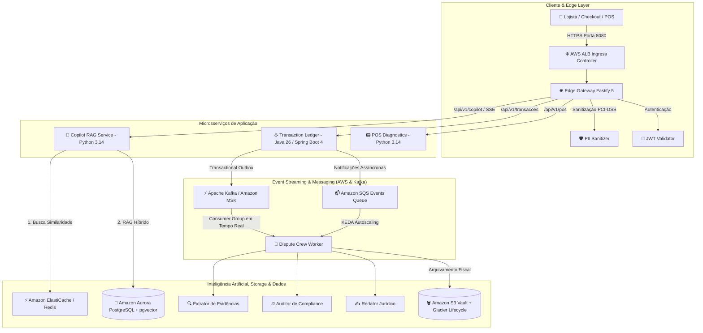
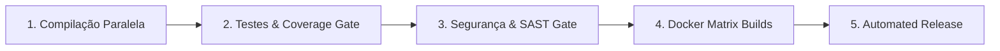

<div align="center">

# ⚡ NexusPay AI Engine

### *Plataforma Enterprise de Pagamentos Digitais, RAG Híbrido e Orquestração de Agentes Autônomos de IA*

[](https://github.com/MarcelDevBr/nexuspay-ai-engine/actions/workflows/ci.yml)
[](https://nodejs.org)
[](https://jdk.java.net/26/)
[](https://spring.io)
[](https://www.python.org)
[](https://kubernetes.io)
[](https://www.terraform.io)
[](LICENSE)

</div>

---

## 📌 Sumário
- [1. Visão Geral do Projeto](#1-visão-geral-do-projeto)
- [2. Arquitetura de Microsserviços & Stack Tecnológica](#2-arquitetura-de-microsserviços--stack-tecnológica)
- [3. Diagrama da Arquitetura do Sistema](#3-diagrama-da-arquitetura-do-sistema)
- [4. Detalhamento dos 5 Microsserviços](#4-detalhamento-dos-5-microsserviços)
- [5. Camada de Inteligência Artificial & Multi-Agentes](#5-camada-de-inteligência-artificial--multi-agentes)
- [6. Engenharia de Dados & Persistência](#6-engenharia-de-dados--persistência)
- [7. Orquestração no Kubernetes (Amazon EKS) & KEDA](#7-orquestração-no-kubernetes-amazon-eks--keda)
- [8. FinOps & AWS Free Tier Guardrail ($1.00 Budget)](#8-finops--aws-free-tier-guardrail-100-budget)
- [9. Esteira DevSecOps & Automated Releases no GitHub Actions](#9-esteira-devsecops--automated-releases-no-github-actions)
- [10. Guia de Execução Local & Testes](#10-guia-de-execução-local--testes)
- [11. Referência de APIs REST & SSE](#11-referência-de-apis-rest--sse)

---

## 1. Visão Geral do Projeto

O **NexusPay AI Engine** é uma plataforma de tecnologia financeira de alta resiliência e ultra-baixa latência projetada para processar transações financeiras em larga escala, oferecer diagnósticos automatizados de hardware de POS e resolver disputas de chargebacks através de **Agentes Autônomos de IA Generativa**.

O ecossistema foi construído do zero utilizando os princípios de **Clean Architecture**, **SOLID**, **Domain-Driven Design (DDD)** e **FinOps**, operando 100% nas versões mais modernas das tecnologias de ponta do mercado (Node.js 26, Java 26, Spring Boot 4 com Lombok e Python 3.14).

### 🎯 Principais Diferenciais:
1. **Ultra-Baixa Latência & Edge Security:** Proteção nativa PCI-DSS com mascaramento em voo de dados sensíveis (PII Sanitizer) e streaming de tokens via Server-Sent Events (SSE).
2. **RAG Híbrido com Cache Semântico:** Busca vetorial combinada (pgvector HNSW + Busca Lexical BM25) com cache semântico em memória no Redis que reduz o custo de LLM para R$ 0,00 e latência para 10ms em perguntas frequentes.
3. **Crew de Multi-Agentes de Chargeback:** 3 agentes autônomos (Extrator de Evidências, Auditor de Compliance de Bandeiras e Redator Jurídico) que geram defesas formais de contestações financeiras automaticamente.
4. **Resiliência Transacional:** Padrão **Transactional Outbox** em Java 26 que garante consistência eventual atômica entre o banco relacional e mensageria assíncrona (Amazon SQS).

---

## 2. Arquitetura de Microsserviços & Stack Tecnológica

O sistema é estruturado em um **Monorepo Modular** composto por 5 microsserviços especializados e desacoplados via **Apache Kafka & Amazon SQS**:

| Microsserviço | Stack Tecnológica | Porta | Responsabilidade Principal |
| :--- | :--- | :--- | :--- |
| **Edge Gateway** | `Node.js 26 LTS` + `Fastify 5` + `TypeScript 5.7` | `8080` | Ponto de entrada único, autenticação JWT Bearer, Rate Limiting, Sanitização PII PCI-DSS e SSE Streaming. |
| **Transaction Ledger Service** | `Java 26` + `Spring Boot 4.0.0-SNAPSHOT` + `Lombok` | `8081` | Core transacional com Virtual Threads, Producer Apache Kafka e Transactional Outbox Pattern. |
| **Copilot RAG Service** | `Python 3.14` + `FastAPI` + `pgvector` + `Redis` | `8000` | Motor de RAG Híbrido (Vetorial HNSW + BM25), roteador de LLMs e Cache Semântico. |
| **POS Diagnostics Service** | `Python 3.14` + `FastAPI` + `Pydantic v2` | `8002` | Telemetria de maquininhas de cartão, análise ISO 8583 e sincronismo EMV/PINPAD. |
| **Dispute Agent Worker** | `Python 3.14` + `CrewAI` + `Kafka Consumer` + `SQS` | Worker | Worker assíncrono para resolução de chargebacks via streaming Kafka e filas SQS com KEDA. |

---

## 3. Diagrama da Arquitetura do Sistema & Event Streaming



---

## 4. Detalhamento dos 5 Microsserviços

### 🌐 1. Edge Gateway (`services/edge-gateway`)
* **Localização:** [`services/edge-gateway`](file:///home/marcel/Desenvolvimento/Projetos/nexuspay-ai-engine/services/edge-gateway)
* **Objetivo:** Atuar como camada perimetral de proteção, rate limiting e proxy reverso de alta performance.
* **Recursos:**
  * Mascaramento automático de cartões (`[CARD_FINAL_4444]`), CPFs (`[CPF_PROTEGIDO]`) e CVV (`[REDACTED]`).
  * Conexões persistentes HTTP com suporte a **Server-Sent Events (SSE)** para streaming de respostas de IA.
  * Rate Limiting distribuído de 1.000 requisições por minuto.

### ☕ 2. Transaction Ledger Service (`services/transaction-ledger-service`)
* **Localização:** [`services/transaction-ledger-service`](file:///home/marcel/Desenvolvimento/Projetos/nexuspay-ai-engine/services/transaction-ledger-service)
* **Objetivo:** Processamento transacional de alta confiabilidade com garantia de ACID e consistência eventual.
* **Recursos:**
  * Uso de **Project Lombok** (`@Data`, `@Builder`, `@NoArgsConstructor`, `@AllArgsConstructor`, `@Slf4j`, `@RequiredArgsConstructor`).
  * **Transactional Outbox Pattern**: Grava a transação e o evento na mesma transação atômica do banco, publicando de forma assíncrona no Amazon SQS via scheduler.
  * Otimizações da JVM Java 26 com **ZGC Generational** e Virtual Threads para suporte a centenas de milhares de conexões concorrentes com pausamento nulo de GC.

### 💬 3. Copilot RAG Service (`services/copilot-rag-service`)
* **Localização:** [`services/copilot-rag-service`](file:///home/marcel/Desenvolvimento/Projetos/nexuspay-ai-engine/services/copilot-rag-service)
* **Objetivo:** Assistente inteligente para lojistas tirarem dúvidas sobre extratos, contratos e taxas de antecipação.
* **Recursos:**
  * **Busca Híbrida:** Reciprocal Rank Fusion combinando busca densa (vetores de 1536 dimensões via pgvector) e busca esparsa (Full-Text Search em português).
  * **Cache Semântico Redis:** Calcula a distância de cosseno entre embeddings de perguntas anteriores. Perguntas com similaridade >= 0.92 retornam em menos de 10ms sem consumir tokens de LLM.

### 📟 4. POS Diagnostics Service (`services/pos-diagnostics-service`)
* **Localização:** [`services/pos-diagnostics-service`](file:///home/marcel/Desenvolvimento/Projetos/nexuspay-ai-engine/services/pos-diagnostics-service)
* **Objetivo:** Diagnóstico em tempo real de maquininhas de cartão físicas e telemetria de conectividade.
* **Recursos:**
  * Resolução de códigos ISO 8583 (ex.: `ERR_58 - Falha de Sincronismo de Chave Criptográfica EMV/PINPAD`).
  * Padrão Strategy para execução de function calling determinístico e correção de falhas de hardware/software.

### 🤖 5. Dispute Agent Worker (`services/dispute-agent-worker`)
* **Localização:** [`services/dispute-agent-worker`](file:///home/marcel/Desenvolvimento/Projetos/nexuspay-ai-engine/services/dispute-agent-worker)
* **Objetivo:** Orquestração autônoma de chargebacks e fraudes financeiras.
* **Recursos:**
  * Orquestração de 3 agentes especializados em **CrewAI**:
    1. **Evidence Extractor Agent:** Coleta logs de geolocalização, IP e hash de chip EMV.
    2. **Compliance Auditor Agent:** Valida os prazos e regras das bandeiras (Visa Core Rules / Mastercard Chargeback Guide).
    3. **Legal Defense Agent:** Redige petição e defesa técnica e financeira estruturada.

---

## 5. Camada de Inteligência Artificial & Multi-Agentes

```text
                               ┌────────────────────────┐
                               │     Pergunta Lojista   │
                               └───────────┬────────────┘
                                           │
                                ┌──────────▼──────────┐
                                │   Embedding Vector  │
                                └──────────┬──────────┘
                                           │
                           ┌───────────────┴───────────────┐
                           ▼                               ▼
                 [ Similaridade >= 0.92? ]       [ Busca Híbrida ]
                 ┌─────────┴─────────┐           ┌─────────┴─────────┐
                 │  SIM (Cache Hit)  │           │   NÃO (Cache Miss)│
                 ├───────────────────┤           ├───────────────────┤
                 │ Redis Semantic    │           │ pgvector (HNSW)   │
                 │ Latência: ~10ms   │           │ + FTS BM25 Lexical│
                 │ Custo: R$ 0,00    │           │ + Bedrock/OpenAI  │
                 └───────────────────┘           └───────────────────┘
```

---

## 6. Engenharia de Dados & Persistência

* **Banco de Dados Relacional:** PostgreSQL 16 com extensão **pgvector**.
* **Índices Vetoriais:** Indexação vetorial com **HNSW (Hierarchical Navigable Small World)** operando com distância de cosseno (`vector_cosine_ops` com `m=16, ef_construction=64`).
* **Particionamento de Tabelas:** A tabela `transacoes` é particionada nativamente por **RANGE de Data (`PARTITION BY RANGE (criado_em)`)**, garantindo escalabilidade para bilhões de registros com descarte de partições antigas em milissegundos.
* **Auditoria PCI-DSS:** Tabela `audit_logs` imutável com logs de acesso e operações de cartões.

---

## 7. Orquestração no Kubernetes (Amazon EKS) & KEDA

Os manifestos de infraestrutura estão organizados via **Kustomize** no diretório [`k8s/`](file:///home/marcel/Desenvolvimento/Projetos/nexuspay-ai-engine/k8s):

```text
k8s/
├── kustomization.yaml                  # Orquestrador declarativo
├── base/
│   ├── namespace.yaml                  # Namespace 'nexuspay'
│   ├── configmap.yaml                  # Configurações globais
│   └── secrets.yaml                    # Segredos e chaves de API protegidas
└── services/
    ├── 01-edge-gateway.yaml            # Deployment (2-10 réplicas), HPA e Ingress AWS ALB
    ├── 02-transaction-ledger-service.yaml # Deployment (2-8 réplicas), ZGC e HPA
    ├── 03-copilot-rag-service.yaml     # Deployment (2-8 réplicas) com HPA
    ├── 04-pos-diagnostics-service.yaml # Deployment (2-6 réplicas) com HPA
    └── 05-dispute-agent-worker.yaml    # Deployment com KEDA ScaledObject (Auto-scaling por SQS)
```

### ⚡ Event-Driven Autoscaling com KEDA:
O worker de chargebacks escala automaticamente a quantidade de pods (de 1 até 10) de acordo com o tamanho da fila **Amazon SQS**, economizando 100% de custos computacionais quando não há contestações pendentes.

---

## 8. FinOps & AWS Free Tier Guardrail ($1.00 Budget)

Para viabilizar portfólio profissional com **custo zero**:

1. **AWS Budgets Guardrail ([`terraform/budgets.tf`](file:///home/marcel/Desenvolvimento/Projetos/nexuspay-ai-engine/terraform/budgets.tf)):** Trava automática com alerta de limite estrito de **US$ 1.00 / mês**.
2. **Ambiente Local 100% Mockado:** Suporte integrado ao **LocalStack**, emulando SQS, S3 e SecretsManager localmente.
3. **Modo Mock LLM:** Todos os microsserviços de IA contam com fallback determinístico local via variável `USE_MOCK_LLM=true`.
4. **EC2 Spot Instances:** Definição no Terraform de NodeGroups Spot no EKS para economia de até 90% em computação.

---

## 9. Esteira DevSecOps & Automated Releases no GitHub Actions

O arquivo [`.github/workflows/ci.yml`](file:///home/marcel/Desenvolvimento/Projetos/nexuspay-ai-engine/.github/workflows/ci.yml) implementa um pipeline completo de 5 estágios:



### 🛡️ Quality & Security Gates:
* **Cobertura de Código:** Relatórios automáticos no Jest (`coverage/`), Surefire e Pytest (`pytest-cov`).
* **SAST & Compliance:** Análise estática com **Semgrep** (regras OWASP Top 10 e PCI-DSS) e **Trivy** (scanner de vulnerabilidades de dependências).
* **Validação de Infraestrutura:** Validação de sintaxe dos manifestos **Kubernetes EKS** e **Terraform Validate**.
* **Releases Automáticas:** Geração automática de release semântica com changelog estruturado e tags de versão (`v1.0.YYYYMMDDHHMM`).

---

## 10. Guia de Execução Local & Testes

### Pré-requisitos:
* **Docker & Docker Compose**
* **Node.js 26** & **Yarn**
* **Java 26** & **Maven Wrapper** (incluso no projeto)
* **Python 3.14** & **uv**

### 1. Subir toda a infraestrutura com Docker Compose:
```bash
docker compose -f docker/docker-compose.yml up -d
```

### 2. Executar a Validação Local Completa (Script Pre-Push):
```bash
./scripts/validate-local.sh
```

```text
================================================================
🚀 Validação Local do NexusPay AI Engine
================================================================
✔ 1/6: Edge Gateway (Node.js 26 / Jest)                       -> 7 passed (100%)
✔ 2/6: Transaction Ledger Service (Java 26 / Spring Boot 4)   -> 2 passed (100%)
✔ 3/6: Copilot RAG Service (Python 3.14 / FastAPI)            -> 10 passed (100%)
✔ 4/6: POS Diagnostics Service (Python 3.14 / FastAPI)        -> 8 passed (100%)
✔ 5/6: Dispute Agent Worker (Python 3.14 / CrewAI)             -> 10 passed (100%)
✔ 6/6: Kubernetes Manifests & Kustomize (Amazon EKS)          -> Validado com Sucesso!
================================================================
🎉 SUCESSO: Todos os microsserviços e esteiras validados!
================================================================
```

---

## 11. Referência de APIs REST & SSE

### 🌐 Edge Gateway (`http://localhost:8080`)
* `GET /health` - Health Check do Gateway
* `POST /api/v1/transacoes` - Roteia criação de transação para o Transaction Ledger
* `POST /api/v1/copilot/chat` - Roteia chat síncrono para o Copilot RAG
* `GET /api/v1/copilot/stream?prompt=...` - Rota de streaming token-por-token via Server-Sent Events (SSE)
* `POST /api/v1/pos/diagnose` - Roteia diagnóstico de POS

### ☕ Transaction Ledger (`http://localhost:8081`)
* `POST /transacoes` - Cria e autoriza nova transação financeira
* `GET /actuator/health` - Health Check do Spring Boot com liveness e readiness probes

### 💬 Copilot RAG (`http://localhost:8000`)
* `GET /health` - Health Check do serviço Python
* `POST /api/v1/copilot/query` - Consulta RAG com busca híbrida e cache semântico

### 📟 POS Diagnostics (`http://localhost:8002`)
* `GET /health` - Health Check do serviço de diagnóstico
* `POST /api/v1/pos/diagnose` - Processa payload de telemetria ISO 8583 e gera plano de ação

---

<div align="center">

Desenvolvido com foco em **Alta Resiliência**, **Segurança PCI-DSS**, **Clean Code** e **FinOps**.

</div>
