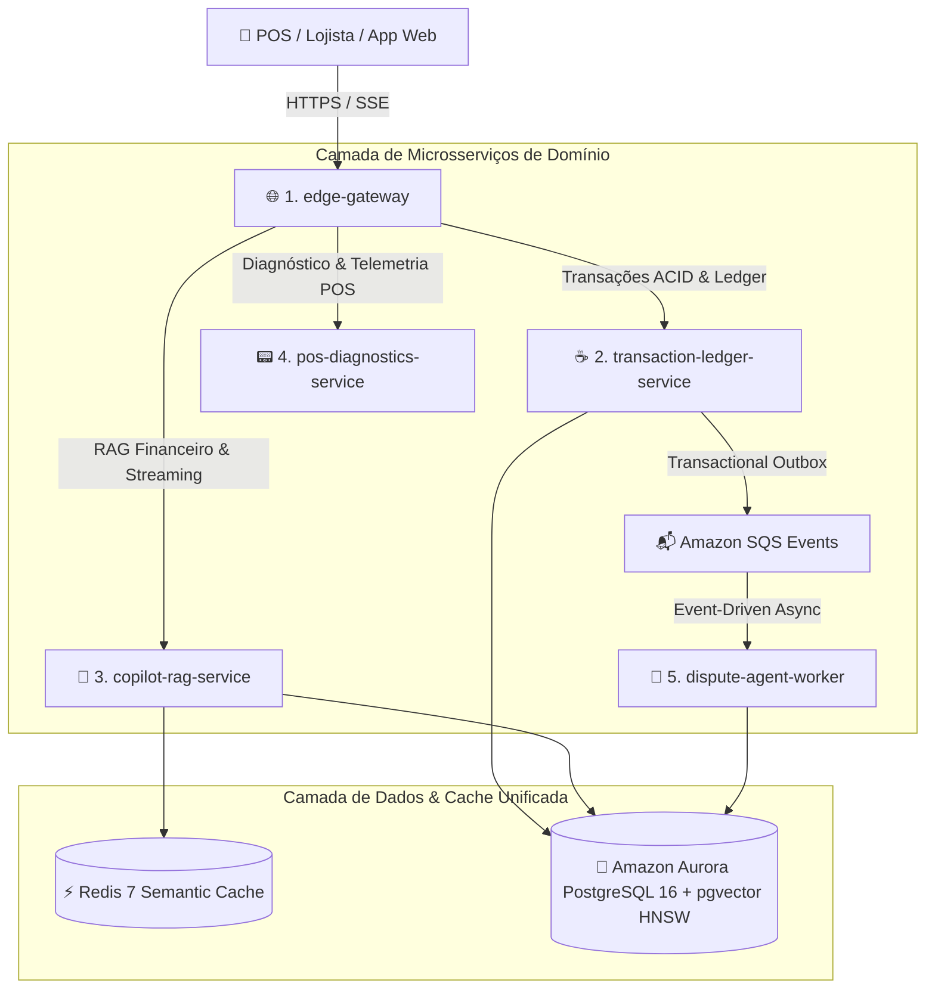

# 🚀 NexusPay AI Engine

<div align="center">

[](https://openjdk.org/)
[](https://spring.io/projects/spring-boot)
[](https://www.python.org/)
[](https://fastapi.tiangolo.com/)
[](https://nodejs.org/)
[](https://fastify.dev/)
[](https://github.com/pgvector/pgvector)
[](https://redis.io/)
[](https://aws.amazon.com/bedrock/)

**Enterprise Polyglot GenAI Platform & Autonomous Multi-Agent Ecosystem for High-Scale Financial Systems**

[Visão Geral](#-executive-tldr-30-second-overview) • [Destaques de Engenharia](#-key-engineering-highlights) • [Arquitetura](#-arquitetura-do-ecossistema) • [Módulos](#-os-5-módulos-especializados) • [Quick Start](#-quick-start-em-1-comando) • [Documentação Completa](docs/projeto_unificado_nexuspay_genai.md)

</div>

---

## ⚡ Executive TL;DR (30-Second Overview)

O **NexusPay AI Engine** é uma plataforma corporativa poliglota de alta escala projetada para o ecossistema financeiro e de adquirência (estilo Stone, Nubank e Stripe). A solução unifica **Node.js 26 (Edge Gateway & SSE)**, **Java 26 (Core Transacional & Ledger ACID com Spring Boot 4)** e **Python 3.14 (RAG Híbrido & Agentes CrewAI)** em torno de um repositório central unificado no **PostgreSQL 16 com `pgvector`** e **Amazon ElastiCache Redis**.

O sistema resolve o conflito clássico entre **consistência bancária estrita** e **automação inteligente com LLMs**, reduzindo custos de inferência em até **70% via Semantic Cache** e defendendo contestações de compras (*chargebacks*) de forma 100% autônoma.

---

## 💎 Key Engineering Highlights

* 🛡️ **Zero Dual-Write Problem:** Unificação de dados relacionais transacionais e vetores de embedding no mesmo banco **PostgreSQL 16 (`pgvector`)** com índice **HNSW** ($O(\log N)$ e recall $>98\%$).
* ⚡ **FinOps & Semantic Cache Sub-10ms:** Cache semântico vetorial em **Redis 7** que intercepta perguntas financeiras frequentes (similaridade de cosseno $\ge 0.92$), retornando respostas em ~10ms com **R$ 0,00 em consumo de tokens**.
* ☕ **Garantia ACID & Transactional Outbox:** Core em **Java 26 com Virtual Threads (Loom)** e **Spring Boot 4** utilizando *Pessimistic Locking* para prevenção de *Double Spending* e *Transactional Outbox Pattern* para entrega garantida de eventos no **Amazon SQS**.
* 🌐 **Edge Protection & PCI-DSS Guardrails:** Gateway em **Node.js 26 / Fastify 5** com sanitização determinística e mascaramento de PII (CPF, Cartão/PAN, CVV) antes de qualquer tráfego chegar às LLMs.
* 🤖 **Multi-Agentes Autônomos de Disputas (CrewAI):** Pipeline de 3 agentes especializados (Extrator de Evidências, Auditor de Compliance Bandeiras/BACEN e Defensor Jurídico-Financeiro) para montagem automatizada de dossiês de chargeback.
* ☁️ **Enterprise Cloud-Native (AWS Bedrock & IRSA):** Modelos corporativos (Claude 3.5 Sonnet / Llama 3) executados via VPC Endpoints privados sem retenção de dados, com autenticação sem credenciais estáticas via *IAM Roles for Service Accounts (IRSA)*.

---

## 🧭 Matriz da Arquitetura Poliglota

A escolha de três linguagens reflete a alocação de cada tecnologia no seu ponto de máxima eficiência:

```text
┌──────────────────────────────────────────────────────────────────────────────────────────────────┐
│                                  ARQUITETURA POLIGLOTA NEXUSPAY                                  │
├──────────────────────────────┬──────────────────────────────────┬────────────────────────────────┤
│ 🌐 Borda & I/O em Tempo Real │ ☕ Core Transacional & Ledger    │ 🐍 Inteligência Artificial     │
│ Node.js 22 / Fastify / TS    │ Java 21 / Spring Boot 4          │ Python 3.13 / FastAPI / CrewAI │
│ (Alta Concorrência de I/O)   │ (Consistência ACID & Resiliência)│ (Ecossistema de IA e LLMs)     │
└──────────────────────────────┴──────────────────────────────────┴────────────────────────────────┘
```

| Camada | Stack Principal | Responsabilidade Primária | Por que esta tecnologia? |
| :--- | :--- | :--- | :--- |
| **🌐 Edge Gateway** | Node.js 22, Fastify, TypeScript | Proxy reverso, Rate Limiting, PII Masking, Streaming SSE | Event-loop não bloqueante com baixo consumo de memória para milhares de conexões persistentes. |
| **☕ Core Transacional** | Java 21, Spring Boot 4, Hibernate | Ledger imutável, autorização, liquidação PIX, Outbox SQS | Tipagem estática robusta, Virtual Threads (Loom) e maturidade absoluta em transações ACID. |
| **🐍 GenAI Engine** | Python 3.13, FastAPI, CrewAI, Pydantic v2 | RAG Híbrido, Multi-Agentes, Smart Router, Embeddings | Padrão da indústria para ecossistema de LLMs, rerankers locais e orquestração de agentes. |
| **🐘 Persistência Unificada** | PostgreSQL 16 + `pgvector` | Base relacional ACID + Busca vetorial (HNSW) | Elimina a complexidade e o risco de inconsistência de bancos vetoriais dedicados isolados. |
| **⚡ Cache Semântico** | Redis 7 Cluster | Cache vetorial em memória, Rate Limit distribuído | Busca de similaridade em submilisegundos para economia massiva de tokens de LLM. |

---

## 🏛️ Arquitetura dos 5 Microsserviços Especializados



| Microsserviço | Stack | Responsabilidade / Domínio |
| :--- | :--- | :--- |
| **🌐 `edge-gateway`** | Node.js 26, Fastify 5, TypeScript | Borda, Rate Limiting, Sanitização PII (PCI-DSS) e Streaming SSE. |
| **☕ `transaction-ledger-service`** | Java 26, Spring Boot 4, Hibernate | Ledger imutável, autorização, liquidação PIX e Transactional Outbox SQS. |
| **💬 `copilot-rag-service`** | Python 3.14, FastAPI, pgvector, Redis | RAG Híbrido, Smart Model Router e Semantic Cache (<10ms / R$ 0,00). |
| **📟 `pos-diagnostics-service`** | Python 3.14, FastAPI | Telemetria de maquininhas, Function Calling e renovação de chaves EMV. |
| **🤖 `dispute-agent-worker`** | Python 3.14, CrewAI, Boto3 | Multi-Agentes autônomos para auditoria e defesa de chargebacks via SQS. |

---

## ☸️ Orquestração de Contêineres no Amazon EKS (Kubernetes)

O ecossistema conta com manifestos declarativos **Kustomize / Kubernetes (EKS v1.31)** para orquestração de produção com alta resiliência e auto-scaling:

```text
k8s/
├── kustomization.yaml                  # Orquestrador Kustomize
├── base/
│   ├── namespace.yaml                  # Namespace 'nexuspay' isolado
│   ├── configmap.yaml                  # Variáveis globais de ambiente
│   └── secrets.yaml                    # Segredos e chaves de API protegidas
└── services/
    ├── 01-edge-gateway.yaml            # Deployment (2-10 réplicas), HPA e Ingress AWS ALB
    ├── 02-transaction-ledger-service.yaml # Deployment (2-8 réplicas), JVM ZGC Generational e HPA
    ├── 03-copilot-rag-service.yaml     # Deployment (2-8 réplicas) com HPA
    ├── 04-pos-diagnostics-service.yaml # Deployment (2-6 réplicas) com HPA
    └── 05-dispute-agent-worker.yaml    # Deployment com KEDA ScaledObject (Auto-scaling por fila SQS)
```

### 🚀 Highlights de Kubernetes no NexusPay:
1. **AWS ALB Ingress Controller:** Roteamento com terminação TLS e baixa latência.
2. **Horizontal Pod Autoscaling (HPA):** Escalabilidade automática baseada em consumo de CPU e Memória.
3. **KEDA (Kubernetes Event-driven Autoscaling):** O worker de chargebacks escala de 1 até 10 pods dinamicamente de acordo com o volume de eventos na fila SQS.
4. **Infraestrutura via Terraform (`terraform/eks.tf`):** Provisionamento de Cluster EKS com Node Groups EC2 Spot para manter conformidade rigorosa de FinOps.

---

## 📂 Estrutura do Monorepo

```text
nexuspay-ai-engine/
├── .github/workflows/
│   ├── ci.yml                          # Matriz CI dos 5 microsserviços + Validação K8s Kustomize
│   └── terraform-validate.yml          # Validação de IaC e FinOps Guardrails
├── k8s/                                # Manifestos Kubernetes Kustomize (Amazon EKS)
│   ├── base/                           # Namespace, ConfigMaps e Secrets
│   └── services/                       # Deployments, Services, HPAs, KEDA e Ingress
├── docker/
│   ├── docker-compose.yml              # Sobe os 5 microsserviços + PostgreSQL (pgvector) + Redis + LocalStack
│   └── init-db/
│       ├── 01-schema.sql               # DDL pgvector HNSW + Partições + Outbox
│       └── 02-seed.sql                 # Dados iniciais
├── terraform/
│   ├── main.tf                         # Configuração AWS & LocalStack
│   ├── eks.tf                          # Cluster Amazon EKS & Spot Node Groups
│   ├── budgets.tf                      # FinOps Guardrail ($1.00 Budget Limit)
│   └── sqs.tf                          # Filas SQS & DLQ
│
└── services/
    ├── edge-gateway/                   # [Node.js 26 / Fastify 5]
    ├── transaction-ledger-service/     # [Java 26 / Spring Boot 4 / Lombok]
    ├── copilot-rag-service/            # [Python 3.14 / FastAPI / pgvector]
    ├── pos-diagnostics-service/        # [Python 3.14 / FastAPI / IoT]
    └── dispute-agent-worker/           # [Python 3.14 / CrewAI / SQS Worker]
```

---

## 🚀 Quick Start em 1 Comando

O projeto inclui suporte completo a **Docker Compose** e **LocalStack**, permitindo rodar e testar todo o ecossistema localmente **sem necessidade de conta AWS real ou custos de nuvem**.

### Pré-requisitos
* [Docker](https://www.docker.com/) e Docker Compose instalados
* Git

### 1. Clonar e Inicializar o Ambiente
```bash
# Clone o repositório
git clone https://github.com/MarcelDevBr/nexuspay-ai-engine.git
cd nexuspay-ai-engine

# Suba todos os serviços (Gateway, Java Core, AI Core, PostgreSQL com pgvector, Redis e LocalStack)
docker compose -f docker/docker-compose.yml up --build -d
```

### 2. Verificar a Saúde dos Serviços
```bash
# Gateway Node.js
curl -i http://localhost:8080/health

# Java 21 Transactional Core
curl -i http://localhost:8081/actuator/health

# Python 3.13 GenAI Engine
curl -i http://localhost:8000/health
```

### 3. Exemplos de Execução Rápida

#### A. Consulta ao Copilot Financeiro via Streaming (RAG + Semantic Cache)
```bash
curl -N -X POST http://localhost:8080/api/v1/chat/stream \
  -H "Content-Type: application/json" \
  -H "Authorization: Bearer mock-jwt-token" \
  -d '{
    "lojista_id": "lojista_123",
    "prompt": "Por que minha taxa de antecipação foi R$ 45,00 ontem?"
  }'
```

#### B. Autorização de Transação Financeira (Core Java ACID + Outbox)
```bash
curl -X POST http://localhost:8080/api/v1/transacoes \
  -H "Content-Type: application/json" \
  -H "Authorization: Bearer mock-jwt-token" \
  -d '{
    "lojista_id": "lojista_123",
    "terminal_id": "POS_789456",
    "valor": 150.00,
    "tipo": "CREDITO_A_VISTA"
  }'
```

---

## 📂 Estrutura do Repositório

```text
nexuspay-ai-engine/
├── .github/workflows/          # CI/CD: Pipeline de testes paralelos (Maven, Pytest, Jest)
├── docker/                     # Dockerfile multi-stage de cada serviço e docker-compose.yml
├── docs/                       # Documentação aprofundada de arquitetura, DDL e decisões
│   └── projeto_unificado_nexuspay_genai.md
├── k8s/                        # Manifests Kubernetes (Deployments, HPA, ConfigMaps)
│
├── gateway/                    # [Node.js 22 / TypeScript / Fastify]
│   └── src/                    # Edge Router, Rate Limiter, PII Masking, SSE Stream
│
├── transactional_core/         # [Java 21 / Spring Boot 4]
│   └── src/main/java/          # Clean Architecture: Domain Entities, Outbox Publisher, SQS
│
└── ai_core/                    # [Python 3.13 / FastAPI]
    └── src/                    # RAG Híbrido, pgvector, Redis Cache, CrewAI Disputas
```

---

## 🛡️ Segurança, Governança e Compliance

* **LGPD & PCI-DSS:** Sanitização em tempo real na camada de borda com mascaramento de PAN/CVV e hash criptográfico de documentos (`cnpj_hash`).
* **Zero Hardcoded Secrets:** Integração com AWS Secrets Manager e *IAM Roles for Service Accounts (IRSA)*.
* **Auditabilidade Imutável:** Todas as ações executadas pelos Agentes Autônomos são registradas em logs com rastreabilidade criptográfica via S3 e KMS.
* **Observabilidade Distribuída:** Tracing ponta a ponta com OpenTelemetry, correlacionando requisições que transitam por Node.js, Java e Python.

---

## 📚 Documentação Aprofundada

Para consultar o DDL SQL completo do `pgvector`, benchmarks detalhados de latência, diagramas de sequência de eventos e guia completo de perguntas técnicas de arquitetura, acesse:

👉 **[Documentação de Arquitetura e Engenharia Detalhada](docs/projeto_unificado_nexuspay_genai.md)**

---

## 👨‍💻 Autor

Desenvolvido por **Marcel da Silva Almeida**  
* [GitHub (@MarcelDevBr)](https://github.com/MarcelDevBr) • [LinkedIn](https://www.linkedin.com/in/marcel-almeida-dev/)

---

## 📄 Licença

Este projeto está licenciado sob a licença [MIT](LICENSE).
