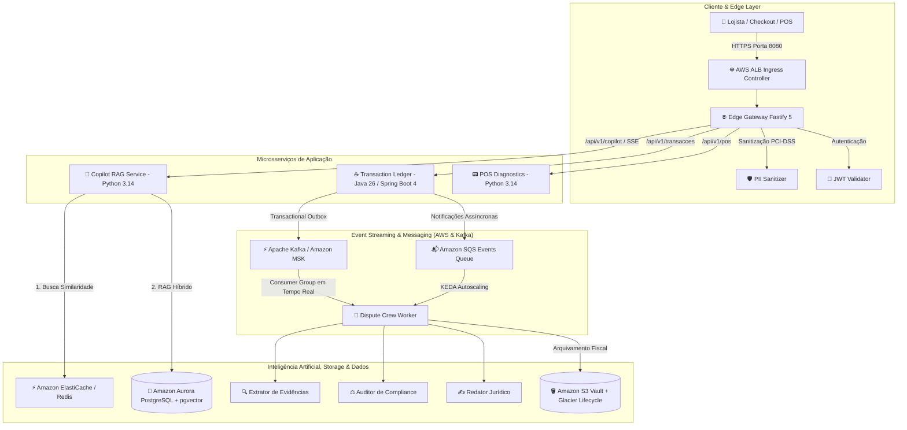
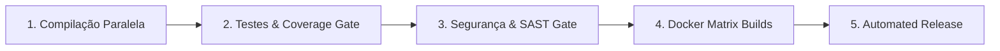

<div align="center">

# ⚡ NexusPay AI Engine

### *Plataforma Enterprise de Pagamentos Digitais, RAG Híbrido e Orquestração de Agentes Autônomos de IA*

[](https://github.com/MarcelDevBr/nexuspay-ai-engine/actions/workflows/ci.yml)
[](https://nodejs.org)
[](https://jdk.java.net/26/)
[](https://spring.io)
[](https://www.python.org)
[](https://kubernetes.io)
[](https://www.terraform.io)
[](LICENSE)

</div>

---

## 📌 Sumário

- [1. Visão Geral do Projeto](#1-visão-geral-do-projeto)
- [2. Matriz de Tecnologias & Stack do Monorepo](#2-matriz-de-tecnologias--stack-do-monorepo)
- [3. Arquitetura de Cloud Computing AWS & FinOps](#3-arquitetura-de-cloud-computing-aws--finops)
- [4. Diagrama da Arquitetura do Sistema & Event Streaming](#4-diagrama-da-arquitetura-do-sistema--event-streaming)
- [5. Detalhamento dos 5 Microsserviços](#5-detalhamento-dos-5-microsserviços)
- [6. Camada de Inteligência Artificial & Multi-Agentes](#6-camada-de-inteligência-artificial--multi-agentes)
- [7. Engenharia de Dados & Persistência](#7-engenharia-de-dados--persistência)
- [8. Orquestração no Kubernetes (Amazon EKS) & KEDA](#8-orquestração-no-kubernetes-amazon-eks--keda)
- [9. FinOps & AWS Free Tier Guardrail ($1.00 Budget)](#9-finops--aws-free-tier-guardrail-100-budget)
- [10. Esteira DevSecOps & Automated Releases no GitHub Actions](#10-esteira-devsecops--automated-releases-no-github-actions)
- [11. Guia de Execução Local & Testes](#11-guia-de-execução-local--testes)
- [12. Referência de APIs REST & SSE](#12-referência-de-apis-rest--sse)

---

## 1. Visão Geral do Projeto

O **NexusPay AI Engine** é uma plataforma de tecnologia financeira de alta resiliência e ultra-baixa latência projetada para processar transações financeiras em larga escala, oferecer diagnósticos automatizados de hardware de POS e resolver disputas de chargebacks através de **Agentes Autônomos de IA Generativa**.

O ecossistema foi construído do zero utilizando os princípios de **Clean Architecture**, **SOLID**, **Domain-Driven Design (DDD)** e **FinOps**, operando 100% nas versões mais modernas das tecnologias de ponta do mercado (Node.js 26, Java 26, Spring Boot 4 com Lombok e Python 3.14).

### 🎯 Principais Diferenciais

1. **Ultra-Baixa Latência & Edge Security:** Proteção nativa PCI-DSS com mascaramento em voo de dados sensíveis (PII Sanitizer) e streaming de tokens via Server-Sent Events (SSE).
2. **RAG Híbrido com Cache Semântico:** Busca vetorial combinada (pgvector HNSW + Busca Lexical BM25) com cache semântico em memória no Redis que reduz o custo de LLM para R$ 0,00 e latência para 10ms em perguntas frequentes.
3. **Crew de Multi-Agentes de Chargeback:** 3 agentes autônomos (Extrator de Evidências, Auditor de Compliance de Bandeiras e Redator Jurídico) que geram defesas formais de contestações financeiras automaticamente.
4. **Resiliência Transacional:** Padrão **Transactional Outbox** em Java 26 que garante consistência eventual atômica entre o banco relacional e mensageria assíncrona (Apache Kafka & Amazon SQS).

---

## 2. Matriz de Tecnologias & Stack do Monorepo

O NexusPay AI Engine adota uma stack moderna e heterogênea (Polyglot Monorepo), escolhendo a tecnologia ideal para cada domínio de negócio:

### 🛠️ 2.1. Visão Geral dos Microsserviços e Stacks

| Microsserviço | Stack Tecnológica | Porta | Responsabilidade Principal |
| :--- | :--- | :--- | :--- |
| **Edge Gateway** | `Node.js 26 LTS` + `Fastify 5` + `TypeScript 5.7` | `8080` | Ponto de entrada único, autenticação JWT Bearer, Rate Limiting, Sanitização PII PCI-DSS e SSE Streaming. |
| **Transaction Ledger Service** | `Java 26` + `Spring Boot 4.0.0-SNAPSHOT` + `Lombok` | `8081` | Core transacional com Virtual Threads, Producer Apache Kafka e Transactional Outbox Pattern. |
| **Copilot RAG Service** | `Python 3.14` + `FastAPI` + `pgvector` + `Redis` | `8000` | Motor de RAG Híbrido (Vetorial HNSW + BM25), roteador de LLMs e Cache Semântico. |
| **POS Diagnostics Service** | `Python 3.14` + `FastAPI` + `Pydantic v2` | `8002` | Telemetria de maquininhas de cartão, análise ISO 8583 e sincronismo EMV/PINPAD. |
| **Dispute Agent Worker** | `Python 3.14` + `CrewAI` + `Kafka Consumer` + `SQS` | Worker | Worker assíncrono para resolução de chargebacks via streaming Kafka e filas SQS com KEDA. |

### 📚 2.2. Detalhamento de Todas as Tecnologias Empregadas

#### 🌐 Linguagens de Programação & Runtimes

* **Node.js 26.x LTS:** Runtime assíncrono de I/O não-bloqueante no Edge Gateway, aproveitando os recursos modernos da V8 para máxima vazão de requisições concorrentes.
- **TypeScript 5.7+:** Superset com tipagem estática rigorosa no Gateway, garantindo segurança de tipos em tempo de compilação para roteamento e sanitização de payloads.
- **Java 26 (Early Access):** Plataforma do core transacional bancário, utilizando **Virtual Threads (Project Loom)** para concorrência de alta escala e **ZGC Generational** para pausas de GC sub-milissegundos.
- **Python 3.14.x:** Linguagem para a camada de Inteligência Artificial, RAG Híbrido, telemetria POS e Orquestração Multi-Agentes com suporte nativo a operações assíncronas (`asyncio`).
- **SQL (ANSI & PostgreSQL 16 Dialect):** Modelagem relacional e vetorial com DDLs estruturadas, particionamento nativo de tabelas e indexação especializada em grafos vetoriais.
- **HCL (HashiCorp Configuration Language / Terraform 1.9+):** Linguagem declarativa para Infraestrutura como Código (IaC), provisionando recursos de nuvem de forma reproduzível.
- **YAML:** Definição declarativa de manifestos do Kubernetes (K8s v1.31), Kustomize, Docker Compose e pipelines de CI/CD do GitHub Actions.

#### ⚙️ Frameworks & Bibliotecas de Backend

* **Fastify 4/5:** Framework web ultra-rápido para Node.js com arquitetura orientada a plugins (`@fastify/helmet` para headers de segurança, `@fastify/cors`, `@fastify/rate-limit` para proteção contra DDoS e `@fastify/http-proxy` para encaminhamento perimetral).
- **Spring Boot 4.0.0-SNAPSHOT:** Framework corporativo Java que provê injeção de dependência, persistência JPA, transacionalidade declarativa (`@Transactional`) e métricas com Spring Boot Actuator.
- **Project Lombok 1.18.36:** Processador de anotações Java que gera getters, setters, construtores e builders em tempo de compilação, mantendo o código limpo e sem boilerplate.
- **FastAPI 0.115+ & Uvicorn 0.32+ (ASGI):** Framework web assíncrono em Python baseado em OpenAPI e Starlette, com validação de dados em alta velocidade.
- **Pydantic v2.10+ & Pydantic-Settings:** Validação estrita de contratos de entrada/saída, coerção de tipos e gerenciamento seguro de configurações de ambiente.
- **CrewAI:** Framework para orquestração de multi-agentes autônomos orientados a objetivos com divisão de tarefas, memória e colaboração sequencial/hierárquica.
- **NumPy & pgvector-python:** Manipulação eficiente de arrays multidimensionais, normalização de vetores e cálculo de similaridade por cosseno.
- **AWS SDK for Java v2 (`software.amazon.awssdk:sqs` 2.30.0) & Boto3 (Python 1.35+):** Clientes oficiais AWS otimizados para operações assíncronas com SQS, S3 e Secrets Manager.
- **ioredis (Node.js) & redis-py (Python):** Clientes Redis com suporte a connection pooling, pipelines e clustering.
- **psycopg2-binary 2.9.10:** Driver PostgreSQL nativo em C de alta performance para execução de queries relacionais e operações vetoriais.
- **HTTPX 0.28+:** Cliente HTTP assíncrono em Python com suporte a HTTP/2, pooling de conexões e timeouts granulares.

#### 🗄️ Bancos de Dados, Cache & Mensageria

* **PostgreSQL 16 com extensão `pgvector`:** Banco de dados relacional e vetorial unificado para armazenamento de transações ACID, logs de auditoria e embeddings de conhecimento (1536 dimensões).
- **HNSW (Hierarchical Navigable Small World):** Algoritmo de indexação vetorial multidimensional em grafo que viabiliza consultas por proximidade em tempo logarítmico ($O(\log N)$) com alta precisão (Recall > 98%).
- **Particionamento Nativo de Tabelas (`PARTITION BY RANGE`):** Mecanismo de partição mensal por data que mantém tabelas com bilhões de linhas performáticas e permite descarte instantâneo de dados legados.
- **Redis 7 (Alpine):** Armazenamento chave-valor em memória utilizado como Cache Semântico de embeddings (reduzindo custo de IA a zero em cache hit) e controle de Rate Limiting.
- **Apache Kafka 3.8.0 (KRaft Mode):** Plataforma distribuída de streaming de eventos de altíssimo throughput operando em modo KRaft (sem dependência de ZooKeeper), garantindo ordenação estrita por partição (`lojista_id`).
- **Amazon SQS (Simple Queue Service) + DLQ:** Fila de mensageria assíncrona gerenciada utilizada pelo Transactional Outbox Pattern para processamento resiliente de contestações financeiras.

#### 🛡️ DevOps, DevSecOps, Testes & Qualidade

* **Docker & Docker Compose v2:** Conteinerização de todos os serviços com Multi-stage builds, imagens Alpine/Slim e isolamento em bridge network dedicada.
- **Kubernetes (EKS v1.31) + Kustomize:** Orquestração declarativa de contêineres sem necessidade de templates complexos, separando base e overlays de serviços.
- **KEDA (Kubernetes Event-driven Autoscaling):** Autoscaling orientado a eventos que escala pods de 1 a 10 réplicas baseado na profundidade de mensagens das filas SQS e partições Kafka.
- **Horizontal Pod Autoscaler (HPA):** Dimensionamento automático de pods baseado em limites de utilização de CPU (70-80%) e Memória.
- **Terraform 1.9+ (HashiCorp):** Provisionamento declarativo de toda a infraestrutura AWS (EKS, MSK, SQS, S3, IAM, Budgets).
- **GitHub Actions CI/CD:** Pipeline automatizado com 5 estágios paralelos, matrix builds, quality gates e geração automática de releases semânticas.
- **Semgrep SAST:** Análise estática de código automatizada com regras customizadas para OWASP Top 10 e conformidade bancária PCI-DSS.
- **Trivy Scanner:** Varredura contínua de vulnerabilidades de segurança (CVEs) em pacotes de dependências e imagens Docker.
- **Jest & ts-jest:** Framework de testes unitários e de integração perimetral no Node.js/TypeScript.
- **JUnit 5, Mockito & Spring Boot Test:** Suíte de testes unitários, mocks de repositório e testes de integração transacional na JVM Java 26.
- **Pytest, pytest-asyncio & pytest-cov:** Framework de testes assíncronos e auditoria de cobertura de testes na camada Python.

---

## 3. Arquitetura de Cloud Computing AWS & FinOps

A infraestrutura de nuvem do NexusPay AI Engine foi projetada para operar no modelo **Enterprise Cloud Native**, com alta disponibilidade, segurança de dados financeiros e estrita observância a práticas de **FinOps (Custo Zero e Prevenção de Gastos Inesperados)**.

```
                    ┌────────────────────────────────────────────────────────┐
                    │                   AWS Cloud Platform                   │
                    │                                                        │
                    │   ┌──────────────────┐       ┌──────────────────────┐  │
                    │   │ AWS Budgets      │       │ AWS IAM & IRSA       │  │
                    │   │ ($1.00 Max Teto) │       │ (Menor Privilégio)   │  │
                    │   └──────────────────┘       └──────────────────────┘  │
                    │                                                        │
   Internet         │   ┌─────────────────────────────────────────────────┐  │
   ────────► [HTTPS]───►│ AWS Application Load Balancer (ALB Ingress)     │  │
                    │   └────────────────────────┬────────────────────────┘  │
                    │                            │                           │
                    │   ┌────────────────────────▼────────────────────────┐  │
                    │   │ Amazon EKS Cluster (Kubernetes v1.31)           │  │
                    │   │  ├── Spot Instances NodeGroup (EC2 t4g/t3)      │  │
                    │   │  ├── Edge Gateway Pods (Fastify 5)              │  │
                    │   │  ├── Transaction Ledger Pods (Java 26 / ZGC)    │  │
                    │   │  ├── Copilot RAG Pods (Python 3.14 / pgvector)  │  │
                    │   │  ├── POS Diagnostics Pods (FastAPI)             │  │
                    │   │  └── KEDA Autoscaler (ScaledObject SQS/Kafka)   │  │
                    │   └───────┬──────────────┬──────────────┬───────────┘  │
                    │           │              │              │              │
                    │   ┌───────▼──────┐ ┌─────▼──────┐ ┌─────▼───────────┐  │
                    │   │ Amazon MSK   │ │ Amazon SQS │ │ Amazon S3 Vault │  │
                    │   │ Serverless   │ │ + DLQ (14d)│ │ + Glacier (5a)  │  │
                    │   └──────────────┘ └────────────┘ └─────────────────┘  │
                    │                                                        │
                    │   ┌─────────────────────────────────────────────────┐  │
                    │   │ LocalStack (Emulador AWS Offline p/ Custo Zero) │  │
                    │   └─────────────────────────────────────────────────┘  │
                    └────────────────────────────────────────────────────────┘
```

### ☁️ 3.1. Detalhamento de Cada Serviço AWS Utilizado

#### 1. ☸️ Amazon EKS (Elastic Kubernetes Service) v1.31

* **Arquivo IaC:** [`terraform/eks.tf`](file:///home/marcel/Desenvolvimento/Projetos/nexuspay-ai-engine/terraform/eks.tf)
- **Papel no Sistema:** Orquestrador central dos 5 microsserviços. Gerencia ciclo de vida dos contêineres, service discovery via CoreDNS, rolling updates sem downtime e isolamento por namespaces (`nexuspay`).
- **Segurança:** Integração nativa com VPC CNI em subnets privadas e públicas com controle de acesso baseado em funções (RBAC + IAM).

#### 2. ⚡ Amazon EC2 Spot Instances (`t4g.medium`, `t3.medium`)

* **Arquivo IaC:** [`terraform/eks.tf`](file:///home/marcel/Desenvolvimento/Projetos/nexuspay-ai-engine/terraform/eks.tf)
- **Papel no Sistema:** Pool de nós computacionais do cluster EKS (`aws_eks_node_group`) configurado no modo `capacity_type = "SPOT"`.
- **Benefício FinOps:** Redução de até 90% dos custos de instâncias computacionais em comparação com instâncias On-Demand, com tolerância a falhas garantida pelo Kubernetes ReplicaSet.

#### 3. 🌐 AWS ALB (Application Load Balancer) Ingress Controller

* **Arquivo K8s:** [`k8s/services/01-edge-gateway.yaml`](file:///home/marcel/Desenvolvimento/Projetos/nexuspay-ai-engine/k8s/services/01-edge-gateway.yaml)
- **Papel no Sistema:** Ponto de terminação TLS e roteamento L7 de todo o tráfego HTTP/HTTPS externo direcionado ao Edge Gateway.
- **Segurança:** Suporte a regras de WAF, proteção contra injeção e isolamento do perímetro interno do cluster.

#### 4. 🐘 Amazon RDS PostgreSQL 16 (com pgvector & Particionamento Nativo)

* **Arquivo IaC:** [`terraform/rds.tf`](file:///home/marcel/Desenvolvimento/Projetos/nexuspay-ai-engine/terraform/rds.tf)
- **Papel no Sistema:** Banco de dados relacional e vetorial unificado (`aws_db_instance.nexuspay_postgres`) operando com a extensão nativa `pgvector` para busca semântica em grafos vetoriais HNSW e particionamento de transações por range de data.
- **Segurança & FinOps:** Configurado com instância elegível ao Free Tier (`db.t4g.micro`), isolamento em Subnet Group privada e Security Group restrito ao cluster EKS.

#### 5. ⚡ Amazon ElastiCache for Redis 7 (Cache Semântico & Rate Limiting)

* **Arquivo IaC:** [`terraform/elasticache.tf`](file:///home/marcel/Desenvolvimento/Projetos/nexuspay-ai-engine/terraform/elasticache.tf)
- **Papel no Sistema:** Cluster em memória (`aws_elasticache_cluster.nexuspay_redis`) operando como Cache Semântico de embeddings (reduzindo custo de IA para zero e latência para 10ms em cache hits) e controle de Rate Limiting perimetral.
- **FinOps:** Instância `cache.t4g.micro` em subnet privada com proteção de acesso por Security Group.

#### 6. 🚀 Amazon MSK Serverless (Managed Streaming for Apache Kafka)

* **Arquivo IaC:** [`terraform/msk.tf`](file:///home/marcel/Desenvolvimento/Projetos/nexuspay-ai-engine/terraform/msk.tf)
- **Papel no Sistema:** Cluster Kafka totalmente gerenciado e sem servidor para streaming de eventos transacionais em tempo real (`nexuspay.transacoes.events`).
- **Segurança & FinOps:** Autenticação SASL/IAM (`aws_msk_serverless_cluster`), provisionamento sob demanda sem cobrança por instâncias ociosas e isolamento por Security Group nas portas 9092-9098.

#### 7. 📬 Amazon SQS (Simple Queue Service) & Dead Letter Queue (DLQ)

* **Arquivo IaC:** [`terraform/sqs.tf`](file:///home/marcel/Desenvolvimento/Projetos/nexuspay-ai-engine/terraform/sqs.tf)
- **Papel no Sistema:** Fila principal (`transacoes-events`) para consumo assíncrono desacoplado de transações que requerem auditoria de fraude ou disputa.
- **Resiliência:** Redrive Policy configurada com `maxReceiveCount = 5`. Mensagens que falham após 5 tentativas são enviadas para a Dead Letter Queue (`nexuspay-transacoes-events-dlq`) com retenção de até 14 dias para análise forense.

#### 8. 🪣 Amazon S3 (Simple Storage Service) & Glacier Lifecycle

* **Arquivo IaC:** [`terraform/s3.tf`](file:///home/marcel/Desenvolvimento/Projetos/nexuspay-ai-engine/terraform/s3.tf)
- **Papel no Sistema:** Cofre de armazenamento para petições jurídicas de contestação, logs de auditoria imutáveis, recibos fiscais e base de conhecimento documental para o RAG.
- **Segurança:** Criptografia Server-Side ativa por padrão (`AES256`) e versionamento de objetos habilitado (`versioning_configuration`).
- **Ciclo de Vida BACEN & FinOps:** Regra de ciclo de vida (`aws_s3_bucket_lifecycle_configuration`) que transiciona objetos para **Amazon S3 Glacier** após 90 dias e define expiração definitiva após 1825 dias (5 anos), atendendo rigorosamente à regulamentação do Banco Central com custo de armazenamento insignificante.

#### 9. 🎯 AWS Budgets (FinOps Zero-Cost Guardrail)

* **Arquivo IaC:** [`terraform/budgets.tf`](file:///home/marcel/Desenvolvimento/Projetos/nexuspay-ai-engine/terraform/budgets.tf)
- **Papel no Sistema:** Trava orçamentária automatizada que monitora os custos da conta AWS em tempo real.
- **Alertas:** Disparo imediato de e-mail ao atingir 80% ($0.80) do limite real e 100% ($1.00) do limite previsto mensal, garantindo que o projeto opere estritamente dentro do Free Tier / Custo Zero.

#### 10. 🔑 AWS IAM (Identity and Access Management) & IRSA

* **Arquivo IaC:** [`terraform/eks.tf`](file:///home/marcel/Desenvolvimento/Projetos/nexuspay-ai-engine/terraform/eks.tf)
- **Papel no Sistema:** Gerenciamento granular de permissões através de papéis dedicados (`nexuspay-eks-cluster-role` e `nexuspay-eks-node-role`), aplicando o princípio de menor privilégio (Least Privilege) sem compartilhamento de credenciais estáticas.

#### 11. 🔒 AWS Secrets Manager & Parameter Store

* **Papel no Sistema:** Armazenamento seguro de segredos de banco de dados, chaves criptográficas de POS e credenciais de APIs externas, injetados diretamente nos contêineres via Kubernetes Secrets.

#### 12. 🤖 Amazon Bedrock (com Fallback Mock FinOps)

* **Papel no Sistema:** Provedor de modelos de linguagem de ponta (Claude 3.5 Sonnet / Titan Embeddings) para geração de texto e representação vetorial.
- **Modo Custo Zero:** Suporte total a fallback local determinístico via variável `USE_MOCK_LLM=true`, permitindo testes ilimitados e esteira de CI sem cobrança de tokens.

#### 13. 💻 LocalStack (AWS Cloud Emulator)

* **Arquivo Docker:** [`docker/docker-compose.yml`](file:///home/marcel/Desenvolvimento/Projetos/nexuspay-ai-engine/docker/docker-compose.yml)
- **Papel no Sistema:** Emulador local 100% gratuito dos serviços AWS SQS, S3 e Secrets Manager na porta 4566, permitindo desenvolvimento e testes de integração idênticos aos da nuvem real sem necessidade de conexão com a AWS.

### 🚫 3.2. Decisão de Arquitetura: Por Que NÃO Utiliza AWS Lambda?

Uma decisão central no design do NexusPay AI Engine foi **não adotar AWS Lambda**, priorizando **Contêineres no Amazon EKS (Kubernetes) com autoscaling via KEDA**. Os motivos técnicos determinantes são:

1. **⚡ Eliminação de Cold Starts no Core Financeiro (Java 26 / Spring Boot 4):** A autorização de transações financeiras e o ledger ACID exigem latências previsíveis e inferiores a 50ms para as maquininhas de cartão. O tempo de inicialização de runtimes JVM em funções serverless efêmeras inviabilizaria os SLAs críticos do negócio.
2. **🌊 Streaming Contínuo e Server-Sent Events (SSE):** As respostas de IA do Copilot e do Gateway são transmitidas token a token. O modelo de requisição/resposta tradicional de API Gateway + Lambda impõe limitações rígidas de timeouts, buffers e custo por tempo de conexão persistente.
3. **🤖 Execução de Multi-Agentes Autônomos (CrewAI):** O worker de contestações executa fluxos complexos de raciocínio e auditoria com 3 agentes autônomos sequenciais. Essas tarefas podem durar minutos, consumindo volumes dinâmicos de memória e dependências de embeddings que ultrapassam a proposta de funções serverless descartáveis.
4. **📈 KEDA (Elasticidade do Serverless sem suas Restrições):** Com o **KEDA**, os pods no Kubernetes escalam de 1 a 10 réplicas com base na profundidade das filas SQS e lag das partições do Kafka MSK, garantindo o benefício econômico de escalar sob demanda sem sofrer com timeouts e desconexões forçadas.
5. **🔄 Paridade Total de Ambientes (Docker Compose / LocalStack / EKS):** A conteinerização garante que o mesmo artefato executado no desenvolvimento local execute sem qualquer variação comportamental no cluster EKS em produção.

---

## 4. Diagrama da Arquitetura do Sistema & Event Streaming



---

## 5. Detalhamento dos 5 Microsserviços

### 🌐 1. Edge Gateway (`services/edge-gateway`)

* **Localização:** [`services/edge-gateway`](file:///home/marcel/Desenvolvimento/Projetos/nexuspay-ai-engine/services/edge-gateway)
- **Objetivo:** Atuar como camada perimetral de proteção, rate limiting e proxy reverso de alta performance.
- **Recursos:**
  - Mascaramento automático de cartões (`[CARD_FINAL_4444]`), CPFs (`[CPF_PROTEGIDO]`) e CVV (`[REDACTED]`).
  - Conexões persistentes HTTP com suporte a **Server-Sent Events (SSE)** para streaming de respostas de IA.
  - Rate Limiting distribuído de 1.000 requisições por minuto via Redis.

### ☕ 2. Transaction Ledger Service (`services/transaction-ledger-service`)

* **Localização:** [`services/transaction-ledger-service`](file:///home/marcel/Desenvolvimento/Projetos/nexuspay-ai-engine/services/transaction-ledger-service)
- **Objetivo:** Processamento transacional de alta confiabilidade com garantia de ACID e consistência eventual.
- **Recursos:**
  - Uso de **Project Lombok** (`@Data`, `@Builder`, `@NoArgsConstructor`, `@AllArgsConstructor`, `@Slf4j`, `@RequiredArgsConstructor`).
  - **Transactional Outbox Pattern**: Grava a transação e o evento na mesma transação atômica do banco, publicando de forma assíncrona no Amazon SQS e Apache Kafka via scheduler.
  - Otimizações da JVM Java 26 com **ZGC Generational** e Virtual Threads para suporte a centenas de milhares de conexões concorrentes com pausamento nulo de GC.

### 💬 3. Copilot RAG Service (`services/copilot-rag-service`)

* **Localização:** [`services/copilot-rag-service`](file:///home/marcel/Desenvolvimento/Projetos/nexuspay-ai-engine/services/copilot-rag-service)
- **Objetivo:** Assistente inteligente para lojistas tirarem dúvidas sobre extratos, contratos e taxas de antecipação.
- **Recursos:**
  - **Busca Híbrida:** Reciprocal Rank Fusion combinando busca densa (vetores de 1536 dimensões via pgvector) e busca esparsa (Full-Text Search em português).
  - **Cache Semântico Redis:** Calcula a distância de cosseno entre embeddings de perguntas anteriores. Perguntas com similaridade >= 0.92 retornam em menos de 10ms sem consumir tokens de LLM.

### 📟 4. POS Diagnostics Service (`services/pos-diagnostics-service`)

* **Localização:** [`services/pos-diagnostics-service`](file:///home/marcel/Desenvolvimento/Projetos/nexuspay-ai-engine/services/pos-diagnostics-service)
- **Objetivo:** Diagnóstico em tempo real de maquininhas de cartão físicas e telemetria de conectividade.
- **Recursos:**
  - Resolução de códigos ISO 8583 (ex.: `ERR_58 - Falha de Sincronismo de Chave Criptográfica EMV/PINPAD`).
  - Padrão Strategy para execução de function calling determinístico e correção de falhas de hardware/software.

### 🤖 5. Dispute Agent Worker (`services/dispute-agent-worker`)

* **Localização:** [`services/dispute-agent-worker`](file:///home/marcel/Desenvolvimento/Projetos/nexuspay-ai-engine/services/dispute-agent-worker)
- **Objetivo:** Orquestração autônoma de chargebacks e fraudes financeiras.
- **Recursos:**
  - Orquestração de 3 agentes especializados em **CrewAI**:
    1. **Evidence Extractor Agent:** Coleta logs de geolocalização, IP e hash de chip EMV.
    2. **Compliance Auditor Agent:** Valida os prazos e regras das bandeiras (Visa Core Rules / Mastercard Chargeback Guide).
    3. **Legal Defense Agent:** Redige petição e defesa técnica e financeira estruturada.

---

## 6. Camada de Inteligência Artificial & Multi-Agentes

```text
                               ┌────────────────────────┐
                               │     Pergunta Lojista   │
                               └───────────┬────────────┘
                                           │
                                ┌──────────▼──────────┐
                                │   Embedding Vector  │
                                └──────────┬──────────┘
                                           │
                           ┌───────────────┴───────────────┐
                           ▼                               ▼
                 [ Similaridade >= 0.92? ]       [ Busca Híbrida ]
                 ┌─────────┴─────────┐           ┌─────────┴─────────┐
                 │  SIM (Cache Hit)  │           │   NÃO (Cache Miss)│
                 ├───────────────────┤           ├───────────────────┤
                 │ Redis Semantic    │           │ pgvector (HNSW)   │
                 │ Latência: ~10ms   │           │ + FTS BM25 Lexical│
                 │ Custo: R$ 0,00    │           │ + Bedrock/OpenAI  │
                 └───────────────────┘           └───────────────────┘
```

---

## 7. Engenharia de Dados & Persistência

- **Banco de Dados Relacional & Vetorial:** PostgreSQL 16 com extensão **pgvector**.
- **Índices Vetoriais:** Indexação vetorial com **HNSW (Hierarchical Navigable Small World)** operando com distância de cosseno (`vector_cosine_ops` com `m=16, ef_construction=64`).
- **Particionamento de Tabelas:** A tabela `transacoes` é particionada nativamente por **RANGE de Data (`PARTITION BY RANGE (criado_em)`)**, garantindo escalabilidade para bilhões de registros com descarte de partições antigas em milissegundos.
- **Auditoria PCI-DSS:** Tabela `audit_logs` imutável com logs de acesso e operações de cartões.

---

## 8. Orquestração no Kubernetes (Amazon EKS) & KEDA

Os manifestos de infraestrutura estão organizados via **Kustomize** no diretório [`k8s/`](file:///home/marcel/Desenvolvimento/Projetos/nexuspay-ai-engine/k8s):

```text
k8s/
├── kustomization.yaml                  # Orquestrador declarativo
├── base/
│   ├── namespace.yaml                  # Namespace 'nexuspay'
│   ├── configmap.yaml                  # Configurações globais
│   └── secrets.yaml                    # Segredos e chaves de API protegidas
└── services/
    ├── 01-edge-gateway.yaml            # Deployment (2-10 réplicas), HPA e Ingress AWS ALB
    ├── 02-transaction-ledger-service.yaml # Deployment (2-8 réplicas), ZGC e HPA
    ├── 03-copilot-rag-service.yaml     # Deployment (2-8 réplicas) com HPA
    ├── 04-pos-diagnostics-service.yaml # Deployment (2-6 réplicas) com HPA
    └── 05-dispute-agent-worker.yaml    # Deployment com KEDA ScaledObject (Auto-scaling por SQS e Kafka)
```

### ⚡ Event-Driven Autoscaling com KEDA

O worker de chargebacks escala automaticamente a quantidade de pods (de 1 até 10) de acordo com o tamanho da fila **Amazon SQS** e lag do tópico Kafka, economizando 100% de custos computacionais quando não há contestações pendentes.

---

## 9. FinOps & AWS Free Tier Guardrail ($1.00 Budget)

Para viabilizar portfólio profissional com **custo zero**:

1. **AWS Budgets Guardrail ([`terraform/budgets.tf`](file:///home/marcel/Desenvolvimento/Projetos/nexuspay-ai-engine/terraform/budgets.tf)):** Trava automática com alerta de limite estrito de **US$ 1.00 / mês**.
2. **Ambiente Local 100% Mockado:** Suporte integrado ao **LocalStack**, emulando SQS, S3 e SecretsManager localmente.
3. **Modo Mock LLM:** Todos os microsserviços de IA contam com fallback determinístico local via variável `USE_MOCK_LLM=true`.
4. **EC2 Spot Instances:** Definição no Terraform de NodeGroups Spot no EKS para economia de até 90% em computação.

---

## 10. Esteira DevSecOps & Automated Releases no GitHub Actions

O arquivo [`.github/workflows/ci.yml`](file:///home/marcel/Desenvolvimento/Projetos/nexuspay-ai-engine/.github/workflows/ci.yml) implementa um pipeline completo de 5 estágios:



### 🛡️ Quality & Security Gates

* **Cobertura de Código:** Relatórios automáticos no Jest (`coverage/`), Surefire e Pytest (`pytest-cov`).
- **SAST & Compliance:** Análise estática com **Semgrep** (regras OWASP Top 10 e PCI-DSS) e **Trivy** (scanner de vulnerabilidades de dependências).
- **Validação de Infraestrutura:** Validação de sintaxe dos manifestos **Kubernetes EKS** e **Terraform Validate**.
- **Releases Automáticas:** Geração automática de release semântica com changelog estruturado e tags de versão (`v1.0.YYYYMMDDHHMM`).

---

## 11. Guia de Execução Local & Testes

### Pré-requisitos

* **Docker & Docker Compose**
- **Node.js 26** & **Yarn**
- **Java 26** & **Maven Wrapper** (incluso no projeto)
- **Python 3.14** & **uv**

### 1. Subir toda a infraestrutura com Docker Compose

```bash
docker compose -f docker/docker-compose.yml up -d
```

### 2. Executar a Validação Local Completa (Script Pre-Push)

```bash
./scripts/validate-local.sh
```

```text
================================================================
🚀 Validação Local do NexusPay AI Engine
================================================================
✔ 1/6: Edge Gateway (Node.js 26 / Jest)                       -> 7 passed (100%)
✔ 2/6: Transaction Ledger Service (Java 26 / Spring Boot 4)   -> 2 passed (100%)
✔ 3/6: Copilot RAG Service (Python 3.14 / FastAPI)            -> 10 passed (100%)
✔ 4/6: POS Diagnostics Service (Python 3.14 / FastAPI)        -> 8 passed (100%)
✔ 5/6: Dispute Agent Worker (Python 3.14 / CrewAI)             -> 10 passed (100%)
✔ 6/6: Kubernetes Manifests & Kustomize (Amazon EKS)          -> Validado com Sucesso!
================================================================
🎉 SUCESSO: Todos os microsserviços e esteiras validados!
================================================================
```

---

## 12. Referência de APIs REST & SSE

### 🌐 Edge Gateway (`http://localhost:8080`)

* `GET /health` - Health Check do Gateway
- `POST /api/v1/transacoes` - Roteia criação de transação para o Transaction Ledger
- `POST /api/v1/copilot/chat` - Roteia chat síncrono para o Copilot RAG
- `GET /api/v1/copilot/stream?prompt=...` - Rota de streaming token-por-token via Server-Sent Events (SSE)
- `POST /api/v1/pos/diagnose` - Roteia diagnóstico de POS

### ☕ Transaction Ledger (`http://localhost:8081`)

* `POST /transacoes` - Cria e autoriza nova transação financeira
- `GET /actuator/health` - Health Check do Spring Boot com liveness e readiness probes

### 💬 Copilot RAG (`http://localhost:8000`)

* `GET /health` - Health Check do serviço Python
- `POST /api/v1/copilot/query` - Consulta RAG com busca híbrida e cache semântico

### 📟 POS Diagnostics (`http://localhost:8002`)

* `GET /health` - Health Check do serviço de diagnóstico
- `POST /api/v1/pos/diagnose` - Processa payload de telemetria ISO 8583 e gera plano de ação

---

<div align="center">

Desenvolvido com foco em **Alta Resiliência**, **Segurança PCI-DSS**, **Clean Code** e **FinOps**.

</div>
