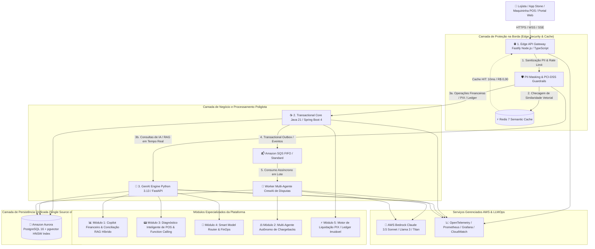
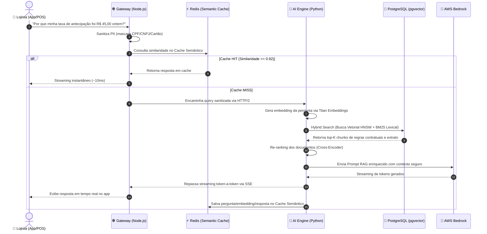
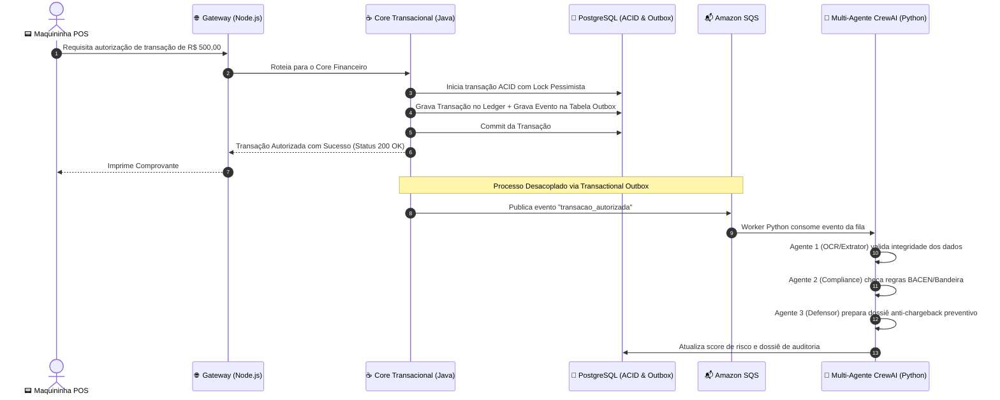
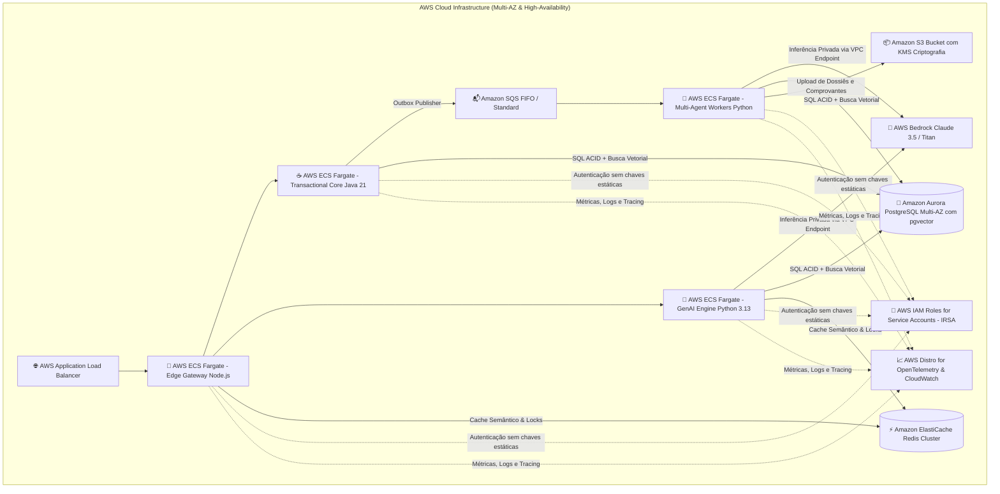
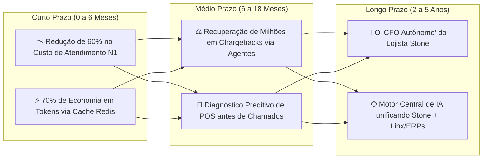

# 🚀 Projeto Flagship Unificado: `NexusPay AI Engine`

**Título:** *Enterprise Polyglot GenAI Platform & Autonomous Multi-Agent Ecosystem for High-Scale Financial Systems*  
**Autor:** Marcel da Silva Almeida ([github.com/MarcelDevBr](https://github.com/MarcelDevBr))  
**Repositório Sugerido:** `https://github.com/MarcelDevBr/nexuspay-ai-engine`  
**Escopo:** Solução corporativa poliglota unindo **Node.js / TypeScript** na borda, **Java 21+ com Spring Boot 4** no core transacional financeiro e **Python 3.13 / FastAPI** no motor de Inteligência Artificial Generativa e Agentes Autônomos.

---

## 🎯 1. O Que É o Projeto e Por Que Ele Existe (A Dor Real do Negócio)

### 💡 O Contexto do Mercado Financeiro e de Adquirência (Stone, Nubank, Itaú, Stripe)

No ecossistema de pagamentos e maquininhas de cartão (*adquirência*), existem três desafios monumentais que operam em tensões opostas:

1. **Consistência Transacional Absoluta e Baixa Latência:** Uma transação de cartão ou PIX não pode falhar, duplicar ou perder dinheiro. Exige garantias ACID estritas, concorrência segura e processamento em milissegundos.
2. **Volume Massivo de Conexões Concorrentes na Borda:** Milhões de maquininhas POS, aplicativos móveis e portais web requisitam dados simultaneamente, exigindo alta escalabilidade de I/O e comunicação em tempo real (WebSockets / SSE).
3. **Complexidade Operacional e Sobrecarga de Suporte:** Lojistas têm dúvidas sobre extratos, taxas de antecipação, conciliação, contestações de compras (*chargebacks*) e erros técnicos de maquininhas. Isso gera milhões de chamados caros para o atendimento humano e perda de receita em disputas não defendidas a tempo.

### 🏆 O Papel do `NexusPay AI Engine`

O `NexusPay AI Engine` é uma **plataforma corporativa unificada de IA Generativa e Processamento Transacional**. Ele não é um mero chatbot: é um ecossistema completo que automatiza o atendimento financeiro, audita disputas com agentes autônomos, diagnostica falhas de maquininhas e executa liquidações financeiras com governança bancária rigorosa.

---

## 🧭 2. Matriz de Cobertura da Arquitetura Poliglota: O "Porquê" de Cada Tecnologia

A escolha de uma arquitetura poliglota (**Node.js + Java + Python**) não é arbitrária. Cada tecnologia foi selecionada cirurgicamente para a camada onde oferece sua melhor performance, explorando seus pontos fortes e contornando suas limitações individuais:

```text
┌──────────────────────────────────────────────────────────────────────────────────────────────────┐
│                                  ARQUITETURA POLIGLOTA NEXUSPAY                                  │
├──────────────────────────────┬──────────────────────────────────┬────────────────────────────────┤
│ 🌐 Borda & I/O em Tempo Real │ ☕ Core Transacional & Ledger    │ 🐍 Inteligência Artificial     │
│ Node.js 22 / Fastify / TS    │ Java 21 / Spring Boot 4          │ Python 3.13 / FastAPI / CrewAI │
│ (Alta Concorrência de I/O)   │ (Consistência ACID & Resiliência)│ (Ecossistema de IA e LLMs)     │
└──────────────────────────────┴──────────────────────────────────┴────────────────────────────────┘
```

### 📊 Tabela Comparativa de Justificativas e Trade-offs

| Camada / Tecnologia | Papel no Ecossistema `NexusPay` | **Por Que Escolhemos Esta Tecnologia? (O Porquê Técnico)** | **Por Que NÃO Outra Tecnologia? (Trade-offs)** |
| :--- | :--- | :--- | :--- |
| **🌐 Edge Gateway (Node.js / TypeScript / Fastify)** | Proxy reverso na borda, Rate Limiting, autenticação JWT, mascaramento de PII e Streaming SSE. | **Event-loop não bloqueante e I/O ultra-eficiente:** Ideal para manter dezenas de milhares de conexões HTTP/SSE/WebSocket abertas simultaneamente com baixo consumo de memória. O Fastify oferece serialização via Ajv e até 4x mais throughput que o Express. | *Por que não Java ou Python aqui?* Java consome mais memória por conexão ociosa em edge; Python (WSGI/ASGI tradicional) tem throughput de I/O bruto inferior para proxies puros. |
| **☕ Core Transacional (Java 21 / Spring Boot 4)** | Autorização de transações, contabilidade (*Ledger* imutável), liquidação PIX, *Pessimistic Locking* e *Transactional Outbox*. | **Solidez, consistência ACID e tipagem estática robusta:** Ecossistema comprovado para processamento financeiro crítico com *Virtual Threads* (Project Loom) no Java 21, garantindo escalabilidade sem reatividade complexa. Spring Data JPA e Spring Cloud AWS maduros. | *Por que não Python ou Node aqui?* Python não possui o mesmo isolamento de threads e ecossistema de transações distribuídas ACID enterprise; Node.js carece de bibliotecas maduras para gerenciamento de transações financeiras pesadas com locks de banco avançados. |
| **🐍 AI Engine & Agentes (Python 3.13 / FastAPI / CrewAI)** | RAG Híbrido (*pgvector*), orquestração de Multi-Agentes de Disputas, Cache Semântico e conexão com AWS Bedrock. | **Padrão de ouro absoluto para IA Generativa:** Todo o ecossistema moderno de LLMs, embeddings, reranking, chunking e frameworks de agentes (CrewAI, LangChain, LlamaIndex) nasce em Python. FastAPI com Pydantic v2 (em Rust) oferece tipagem e serialização de altíssima velocidade. | *Por que não Java ou Node para IA?* Bibliotecas de IA em Java (Spring AI) e Node.js ainda são imaturas, com suporte limitado a rerankers locais, parsers de documentos e ecossistemas de agentes autônomos avançados. |
| **🐘 Amazon RDS PostgreSQL 16 (`pgvector`)** | Base unificada relacional particionada e repositório vetorial com índice **HNSW**. | **Eliminação do Dual-Write Problem:** Armazena dados transacionais relacionais (tabelas ACID) e vetores de embeddings no mesmo banco de dados com consistência transacional nativa. Índice HNSW garante busca logarítmica $O(\log N)$ com recall superior a 98%. | *Por que não Pinecone/Milvus separado?* Bancos vetoriais dedicados criam complexidade operacional, descompasso de sincronização entre IDs de transações e vetores e aumentam os custos de infraestrutura em nuvem. |
| **⚡ Amazon ElastiCache Redis 7** | Cache Semântico vetorial de respostas de IA, distributed locks e rate limiting. | **Latência submilisegunda em memória e economia de custos FinOps:** Armazena pares de pergunta-vetor/resposta. Consultas repetidas ou semanticamente semelhantes são respondidas em ~10ms sem gastar tokens caros na AWS Bedrock. | *Por que não cache local em memória na aplicação?* Cache local não é compartilhado entre réplicas horizontais de contêineres e perde o estado durante re-deploys. |
| **📬 Amazon SQS & SNS / EventBridge** | Barramento de mensageria assíncrona entre o Core Java, o Gateway Node e os Workers Python. | **Desacoplamento temporal e proteção contra picos de tráfego (Backpressure):** Filas FIFO garantem ordenação estrita em liquidação financeira; filas Standard garantem processamento paralelo massivo para auditoria de disputas e diagnósticos. | *Por que não chamadas síncronas REST entre serviços?* Chamadas síncronas geram acoplamento rígido, falhas em cascata e perda de dados se o serviço consumidor estiver temporariamente sobrecarregado. |
| **🤖 AWS Bedrock (Claude 3.5 Sonnet / Llama 3)** | Inferência gerenciada de LLMs corporativos e geração de embeddings (Titan Embeddings v2). | **Soberania e privacidade de dados (Enterprise Compliance):** Modelos rodam dentro da VPC da AWS sem retenção nem treinamento com dados de clientes, em conformidade com LGPD e normas do Banco Central do Brasil (BACEN). | *Por que não chamar a API pública da OpenAI direta?* Enviar dados de lojistas para APIs públicas de terceiros viola políticas de segurança bancária e normas de privacidade PCI-DSS da Stone. |
| **🛡️ AWS IAM (IRSA) & Secrets Manager** | Gestão de identidade e permissões de acesso a recursos da nuvem. | **Segurança sem credenciais estáticas (Zero-Hardcoded Secrets):** Uso de *IAM Roles for Service Accounts (IRSA)* no Kubernetes/ECS, garantindo credenciais temporárias de curto prazo e rotação automática. | *Por que não variáveis de ambiente com access keys?* Chaves estáticas em variáveis de ambiente representam um dos maiores vetores de vazamento de segurança em ambientes corporativos. |
| **📦 Amazon S3 + KMS** | Armazenamento seguro de comprovantes de transação, manuais técnicos e logs de auditoria. | **Durabilidade de 11 noves (99.999999999%) e criptografia em repouso:** Armazena documentos não estruturados com criptografia gerenciada por chave KMS exclusiva do cliente. | *Por que não salvar binários diretamente no PostgreSQL?* Gravar arquivos binários/PDFs no banco relacional incha o storage, degrada a memória de buffer pool e afeta a performance de queries SQL. |
| **🐳 Docker + LocalStack** | Ambiente de desenvolvimento local e esteira de testes automatizados. | **Paridade total de ambiente sem custo de nuvem:** Simula SQS, S3, RDS e Bedrock localmente no `docker-compose`, permitindo rodar testes de integração e CI/CD completos sem gastar orçamento de cloud. | *Por que não depender de uma conta AWS real para testes de desenvolvimento?* Custo desnecessário, latência de rede em testes automatizados e risco de poluição de dados em ambientes compartilhados. |

---

## 🌟 3. Diagrama de Arquitetura Completa do Ecossistema



---

## 🧩 4. Fluxo de Execução Integrado dos 3 Ecossistemas

### Cenário 1: Consulta de Dúvida Financeira de Lojista com Cache Semântico e RAG (Fluxo Síncrono em Streaming)



### Cenário 2: Processamento Transacional de Venda e Auditoria Assíncrona de Disputa (Fluxo Orientado a Eventos)



---

## 🏛️ 5. Padrões de Arquitetura de Software e Design Patterns

### 1. Clean Architecture (Hexagonal / Ports & Adapters)

Tanto o serviço Java quanto o serviço Python são estruturados rigorosamente sob a Clean Architecture:

- **Por que usamos?** O *Domínio* (regras de cálculo financeiro, validações de transação e lógica de auditoria) é 100% puro e independente de detalhes externos. Se a Stone migrar do PostgreSQL para o DynamoDB, do SQS para o Kafka ou da AWS Bedrock para o Azure OpenAI, **nenhuma linha do código de negócio precisa ser alterada**.

```text
┌────────────────────────────────────────────────────────┐
│  Frameworks & Drivers (Borda Externa)                  │
│  FastAPI, Spring Boot 4, Fastify, AWS SQS, Postgres    │
│  ┌──────────────────────────────────────────────────┐  │
│  │  Interface Adapters (Controllers, Repositories)  │  │
│  │  PostgresVectorRepo, SpringDataJPA, SQSWorkers   │  │
│  │  ┌────────────────────────────────────────────┐  │  │
│  │  │  Use Cases / Application Layer             │  │  │
│  │  │  ExecutarRAGConsulta, ProcessarTransacao   │  │  │
│  │  │  ┌──────────────────────────────────────┐  │  │  │
│  │  │  │  Domain Entities & Enterprise Rules  │  │  │  │
│  │  │  │  Transacao, DisputaFinanceira, RAG   │  │  │  │
│  │  │  └──────────────────────────────────────┘  │  │  │
│  │  └────────────────────────────────────────────┘  │  │
│  └──────────────────────────────────────────────────┘  │
└────────────────────────────────────────────────────────┘
```

### 2. Transactional Outbox Pattern

- **O Problema:** Em sistemas distribuídos, se o Core Java gravar a transação no banco de dados e a rede cair antes de enviar a mensagem para o SQS, o sistema perde o evento. Se enviar para o SQS primeiro e o banco der rollback, a mensagem é processada indevidamente.
- **A Solução:** O Java grava a transação e o evento na mesma transação local ACID do PostgreSQL (tabela `outbox_events`). Um worker em segundo plano lê os eventos confirmados e os envia ao SQS com garantia de entrega *At-Least-Once*.

### 3. Circuit Breaker com Graceful Degradation

- **O Problema:** Provedores de LLM podem apresentar lentidão temporária ou indisponibilidade (HTTP 503 / 429).
- **A Solução:** Implementado via Resilience4j (no Java) e Tenacity/Custom Wrapper (no Python). Se a taxa de erros no AWS Bedrock ultrapassar 30% em uma janela de 10 segundos, o circuito se abre e a aplicação devolve respostas contingenciais baseadas em regras determinísticas ou cache histórico, evitando timeout no cliente.

### 4. Semantic Cache Pattern (FinOps em IA)

- **O Problema:** 40% das perguntas de lojistas são repetições das mesmas dúvidas (ex.: taxas de maquininha, prazos de liquidação PIX). Re-executar o LLM para todas elas queima milhares de dólares em tokens e adiciona 2 a 3 segundos de latência.
- **A Solução:** O embedding da pergunta é comparado no Redis com perguntas anteriores via distância de cosseno. Similaridades superiores a 0.92 retornam o resultado pré-calculado em ~10ms com custo de token zero.

### 5. Smart Model Routing (Otimizador de Custo & Latência)

- **O Problema:** Utilizar modelos de alta capacidade (como Claude 3.5 Sonnet) para tarefas triviais (ex.: categorizar uma pergunta em 3 palavras) é um desperdício financeiro.
- **A Solução:** Um classificador leve em Python roteia requisições simples para modelos pequenos e rápidos (ex.: Llama 3 8B / GPT-4o-mini) e reserva os modelos de raciocínio pesado (Claude 3.5 Sonnet) exclusivamente para conciliação contábil complexa e auditoria de disputas.

---

## 🛠️ 6. Os 5 Módulos Especializados da Plataforma Explicados em Detalhes

### 📊 Módulo 1: Copilot Financeiro & Conciliação com RAG Híbrido

- **Objetivo:** Responder a dúvidas de extrato, taxas e conciliação em tempo real com streaming.
- **Por que RAG Híbrido (Vetorial + Lexical)?**
  - A *Busca Vetorial Pura (Dense)* compreende o significado semântico ("quanto me cobraram de taxa?"), mas falha miseravelmente ao buscar termos exatos, como códigos alfanuméricos de autorização (`AUTH_987654`) ou valores monetários específicos (`R$ 1.450,20`).
  - A *Busca Lexical (Sparse - BM25)* encontra códigos e números exatos com perfeição, mas não entende sinônimos.
  - A *Fusão Híbrida com RRF (Reciprocal Rank Fusion) + Cross-Encoder Reranker* une o melhor dos dois mundos, entregando precisão superior a 99% sem alucinações.

### ⚖️ Módulo 2: Multi-Agente Autônomo para Resolução de Disputas & Chargebacks (CrewAI)

- **Objetivo:** Defender automaticamente contestações de compras feitas por portadores de cartão.
- **Por que Múltiplos Agentes Especializados e não um Prompt Único?**
  - Dividir uma tarefa complexa em papéis especializados reduz drasticamente as alucinações e permite validações intermediárias:
    1. *Agente 1 (Extrator de Evidências):* Extrai dados de comprovantes de venda (POS), geolocalização e logs de autorização.
    2. *Agente 2 (Auditor de Compliance):* Consulta a base vetorial de regras das bandeiras (Visa Core Rules / Mastercard Chargeback Guide) e normativas do BACEN.
    3. *Agente 3 (Redator Jurídico-Financeiro):* Redige a contestação formal, calcula o score de probabilidade de ganho e monta o pacote probatório.

### 📟 Módulo 3: Diagnóstico Inteligente de Falhas em Maquininhas POS & Function Calling

- **Objetivo:** Resolver erros de hardware, conectividade e transações rejeitadas em maquininhas.
- **Por que Function Calling Determinístico?**
  - O modelo de IA nunca executa comandos diretamente. Ele retorna uma chamada estruturada de função (*tool use*), que é validada e executada pelo backend:
    - `reset_pos_security_keys(terminal_id)`
    - `check_telemetry_connectivity(terminal_id)`
    - `decode_iso8583_error_code(response_code)`

### 🧠 Módulo 4: Smart Model Routing & FinOps de Tokens

- **Objetivo:** Minimizar a fatura de IA corporativa mantendo a máxima qualidade nas respostas.
- **Estratégia:** Análise de complexidade do prompt na borda. Prompts informativos simples vão para modelos leves; conciliações financeiras profundas vão para modelos de ponta.

### ⚡ Módulo 5: Core Transacional de Liquidação PIX & Ledger Imutável (Spring Boot 4)

- **Objetivo:** Processamento de pagamentos com tolerância zero a inconsistências.
- **Estratégia:** Gravação de transações em modelo de *Ledger* de dupla entrada (débito/crédito), locks pessimistas no banco para prevenir *Double Spending* e publicação assíncrona garantida via Transactional Outbox.

---

## 🐘 7. Modelagem de Dados no PostgreSQL com `pgvector` e Índice HNSW

### DDL Completo e Explicado Linha por Linha

```sql
-- 1. Habilita a extensão vetorial nativa do PostgreSQL
CREATE EXTENSION IF NOT EXISTS vector;
CREATE EXTENSION IF NOT EXISTS "uuid-ossp";

-- =============================================================================
-- TABELAS RELACIONAIS TRANSACIONAIS (Gerenciadas pelo Core Java / Spring Boot)
-- =============================================================================

-- Tabela de Lojistas com isolamento de dados (Multi-tenancy)
CREATE TABLE lojistas (
    id VARCHAR(50) PRIMARY KEY,
    razao_social VARCHAR(255) NOT NULL,
    cnpj_hash VARCHAR(64) NOT NULL UNIQUE, -- CNPJ armazenado como hash para PCI-DSS/LGPD
    email_contato VARCHAR(150) NOT NULL,
    status VARCHAR(20) NOT NULL DEFAULT 'ATIVO',
    criado_em TIMESTAMP WITH TIME ZONE DEFAULT NOW()
);

-- Tabela Particionada de Transações Financeiras (Alta escala de escrita)
-- Por que particionada por RANGE de data? Para permitir pruning de queries e arquivamento eficiente.
CREATE TABLE transacoes (
    id UUID DEFAULT gen_random_uuid(),
    lojista_id VARCHAR(50) NOT NULL REFERENCES lojistas(id),
    terminal_id VARCHAR(50),               -- Identificador da maquininha POS
    valor NUMERIC(15, 2) NOT NULL,          -- Precisão monetária fixa (nunca use FLOAT/DOUBLE para dinheiro)
    tipo VARCHAR(20) NOT NULL,              -- PIX, CREDITO_A_VISTA, CREDITO_PARCELADO, DEBITO
    status VARCHAR(20) NOT NULL,            -- AUTORIZADA, NEGADA, LIQUIDADA, EM_DISPUTA
    codigo_autorizacao VARCHAR(50),
    criado_em TIMESTAMP WITH TIME ZONE NOT NULL DEFAULT NOW(),
    PRIMARY KEY (id, criado_em)
) PARTITION BY RANGE (criado_em);

-- Criação de partições mensais para alta performance de escrita e leitura
CREATE TABLE transacoes_2026_01 PARTITION OF transacoes
    FOR VALUES FROM ('2026-01-01 00:00:00+00') TO ('2026-02-01 00:00:00+00');
CREATE TABLE transacoes_2026_02 PARTITION OF transacoes
    FOR VALUES FROM ('2026-02-01 00:00:00+00') TO ('2026-03-01 00:00:00+00');
CREATE TABLE transacoes_2026_03 PARTITION OF transacoes
    FOR VALUES FROM ('2026-03-01 00:00:00+00') TO ('2026-04-01 00:00:00+00');

-- Tabela do Transactional Outbox Pattern para garantir entrega de eventos no SQS
CREATE TABLE outbox_events (
    id UUID PRIMARY KEY DEFAULT gen_random_uuid(),
    aggregate_type VARCHAR(50) NOT NULL,   -- Ex: 'TRANSAÇÃO', 'DISPUTA'
    aggregate_id VARCHAR(100) NOT NULL,
    event_type VARCHAR(100) NOT NULL,      -- Ex: 'TransacaoCriadaEvent'
    payload JSONB NOT NULL,                -- Dados do evento prontos para o SQS
    status VARCHAR(20) NOT NULL DEFAULT 'PENDENTE', -- PENDENTE, PROCESSADO, FALHA
    criado_em TIMESTAMP WITH TIME ZONE DEFAULT NOW(),
    processado_em TIMESTAMP WITH TIME ZONE
);

CREATE INDEX idx_outbox_pendentes ON outbox_events(status, criado_em) WHERE status = 'PENDENTE';

-- =============================================================================
-- TABELAS VETORIAIS E BASE DE CONHECIMENTO RAG (Gerenciadas pelo AI Core Python)
-- =============================================================================

CREATE TABLE documentos_conhecimento (
    id UUID PRIMARY KEY DEFAULT gen_random_uuid(),
    titulo VARCHAR(255) NOT NULL,
    categoria VARCHAR(50) NOT NULL,        -- 'TAXAS', 'MAQUININHAS', 'PIX', 'COMPLIANCE_BACEN'
    conteudo TEXT NOT NULL,
    metadados JSONB NOT NULL DEFAULT '{}', -- Metadados para filtragem pré-busca (ex: versão do contrato)
    tsv_conteudo tsvector GENERATED ALWAYS AS (to_tsvector('portuguese', conteudo)) STORED, -- Para busca BM25
    embedding vector(1536) NOT NULL,       -- 1536 dimensões (compatível com Titan Embeddings / OpenAI)
    atualizado_em TIMESTAMP WITH TIME ZONE DEFAULT NOW()
);

-- 1. Índice Textual Full-Text Search (GIST/GIN) para Busca Lexical (BM25)
CREATE INDEX idx_documentos_tsv ON documentos_conhecimento USING gin(tsv_conteudo);

-- 2. Índice Vetorial HNSW de Alta Performance
-- Por que HNSW e não IVFFlat? 
-- - HNSW constrói um grafo multicamada navegável com tempo de busca O(log N) e recall superior a 98%.
-- - IVFFlat exige recriação periódica de listas com clusterização K-means quando os dados crescem.
-- Parâmetros: m = 16 (número de conexões por nó), ef_construction = 64 (profundidade de busca na indexação).
CREATE INDEX idx_documentos_embedding_hnsw 
ON documentos_conhecimento 
USING hnsw (embedding vector_cosine_ops)
WITH (m = 16, ef_construction = 64);
```

---

## ☁️ 8. Arquitetura Cloud-Native na AWS (Amazon Web Services)



### 🛠️ Por Que Cada Serviço AWS Foi Escolhido?

1. **AWS ECS / Fargate (Serverless Containers):**
   - *Porquê:* Elimina a necessidade de gerenciar instâncias de servidores virtuais (EC2), aplicando patches de segurança automáticos e escalando os contêineres de forma elástica em resposta à carga de CPU ou tamanho das filas SQS.
2. **AWS Bedrock (Modelos Fundacionais Gerenciados):**
   - *Porquê:* Permite acessar os melhores modelos do mundo (Claude 3.5 Sonnet da Anthropic e Llama 3 da Meta) com faturamento sob demanda e garantia contratual de que os dados financeiros da Stone **nunca** serão gravados ou usados para retreinar modelos públicos.
3. **Amazon Aurora PostgreSQL Serverless v2 (`pgvector`):**
   - *Porquê:* Auto-scaling dinâmico de capacidade computacional (ACUs), réplicas de leitura para desafogar o banco principal e armazenamento tolerante a falhas distribuído em 3 Zonas de Disponibilidade (AZs).
4. **Amazon SQS (Simple Queue Service):**
   - *Porquê:* Mensageria 100% gerenciada com retenção de até 14 dias, suporte a Dead Letter Queues (DLQ) para mensagens com falha e garantia de entrega de alta disponibilidade.
5. **Amazon ElastiCache for Redis:**
   - *Porquê:* Cluster em memória com replicação e failover automático, mantendo o Cache Semântico de IA acessível a qualquer momento com latência inferior a 5ms.
6. **LocalStack (Paridade Local no Docker):**
   - *Porquê:* Permite que qualquer engenheiro ou avaliador execute toda a infraestrutura AWS (SQS, S3, Secrets Manager) localmente na sua máquina com um simples `docker-compose up`, sem necessitar de cartão de crédito ou conta corporativa da AWS.

---

## 📂 9. Estrutura Completa de Pastas do Repositório

```text
nexuspay-ai-engine/
├── .github/
│   └── workflows/
│       └── ci-cd.yml                   # CI/CD: Matriz de testes paralelos Java (Maven), Python (Pytest) e Node (Jest)
├── docker/
│   ├── docker-compose.yml              # Sobe Gateway, Java Core, AI Core, Postgres (pgvector), Redis e LocalStack
│   ├── Dockerfile.gateway              # Multi-stage build Node.js 22 / TypeScript
│   ├── Dockerfile.java-core            # Multi-stage build Eclipse Temurin JDK 21 / Spring Boot 4
│   └── Dockerfile.ai-core              # Multi-stage build Python 3.13 com uv / Poetry
├── k8s/
│   ├── deployment-gateway.yaml         # Manifests Kubernetes com HPA
│   ├── deployment-java.yaml            # Deployment Java com Probes de liveness/readiness
│   ├── deployment-python.yaml          # Deployment Python com tolerâncias de GPU/CPU
│   └── configmap.yaml
│
├── gateway/                             # [Node.js 22 / TypeScript / Fastify]
│   ├── src/
│   │   ├── server.ts                   # Inicialização do Fastify com Helmet e Cors
│   │   ├── middlewares/
│   │   │   ├── auth_jwt.ts             # Validação de token JWT
│   │   │   ├── pii_sanitizer.ts        # Mascaramento de dados sensíveis (PCI-DSS)
│   │   │   └── rate_limiter.ts         # Proteção contra abuso via Redis
│   │   └── routes/
│   │       ├── proxy.ts                # Roteamento inteligente de tráfego
│   │       └── sse_stream.ts           # Canal de Streaming Server-Sent Events
│   ├── package.json
│   └── tsconfig.json
│
├── transactional_core/                  # [Java 21 / Spring Boot 4]
│   ├── pom.xml                         # Dependências Spring Boot 4, Spring Data JPA, AWS SDK v2, PostgreSQL
│   └── src/main/java/com/nexuspay/
│       ├── domain/                     # Entities puras de negócio (Transacao, Lojista, Ledger)
│       ├── application/
│       │   ├── usecases/               # ProcessarTransacaoUseCase, LiquidarPixUseCase
│       │   └── ports/                  # Interfaces de Repositório e Produtor de Mensagens
│       └── infrastructure/
│           ├── adapters/
│           │   ├── controllers/        # REST Controllers (Endpoints /api/v1/transacoes)
│           │   ├── persistence/        # Repositórios Spring Data JPA e Outbox Publisher
│           │   └── messaging/          # Produtor Amazon SQS via AWS SDK v2
│           └── config/                 # Configurações de Bean e Virtual Threads
│
├── ai_core/                             # [Python 3.13 / FastAPI]
│   ├── pyproject.toml                  # Dependências gerenciadas via Poetry / uv
│   ├── src/
│   │   ├── main.py                     # Instanciação do app FastAPI com lifespan
│   │   ├── api/v1/
│   │   │   ├── copilot.py              # Endpoint SSE (/api/v1/chat/stream)
│   │   │   └── diagnosis.py            # Endpoint de diagnóstico POS
│   │   ├── domain/
│   │   │   └── schemas.py              # Modelos Pydantic v2 com validação estrita
│   │   ├── services/
│   │   │   ├── rag_service.py          # Hybrid Search (pgvector + BM25 + Cross-Encoder Reranker)
│   │   │   ├── semantic_cache.py       # Cache Semântico vetorial com Redis
│   │   │   └── model_router.py         # Smart Router de modelos LLM
│   │   ├── agents/
│   │   │   └── dispute_crew.py         # Multi-Agentes CrewAI (Extrator, Compliance, Defensor)
│   │   └── workers/
│   │       └── sqs_consumer.py         # Consumidor de eventos assíncronos SQS
│   └── tests/                          # Testes unitários e de integração (Pytest / 90%+ coverage)
│
└── README.md                           # Documentação executiva completa com diagramas Mermaid
```

---

## 📈 10. Impacto de Negócio, ROI & Visão Estratégica para a Stone

Para os Engineering Managers (Ricardo Lobo e Ricardo Ventura), o maior valor de um Engenheiro Especialista/Sênior é demonstrar **como a engenharia de software e a IA geram receita, cortam custos e protegem a liderança de mercado da Stone**:



### 💰 1. Curto Prazo (0 a 6 Meses) — Eficiência Operacional Imediata & FinOps

- **Deflexão de Chamados de Suporte:** O Copilot com RAG Híbrido resolve mais de 60% das dúvidas recorrentes sobre conciliação bancária, taxas de antecipação e extratos sem intervenção humana.
- **FinOps de IA na Prática:** O **Cache Semântico em Redis** e o **Smart Model Router** eliminam chamadas redundantes a modelos caros, reduzindo a conta de nuvem da AWS Bedrock em até **70%**.

### ⚖️ 2. Médio Prazo (6 a 18 Meses) — Recuperação de Perdas & Retenção (*Anti-Churn*)

- **Defesa Automatizada de Chargebacks:** Os agentes autônomos do CrewAI analisam e montam defesas de contestações em minutos, garantindo que o lojista nunca perca prazos regulatórios do BACEN ou regras de bandeira (Visa/Mastercard), recuperando milhões de reais em receitas contestadas.
- **Redução de Churn por Falha de Maquininha:** O módulo de diagnóstico de POS detecta e resolve proativamente falhas de rede e chaves de segurança antes do lojista abrir chamado, aumentando o *Net Promoter Score (NPS)*.

### 👑 3. Longo Prazo (2 a 5 Anos) — O "CFO Virtual" e a Integração com Linx/ERPs

- **De Chatbot para "CFO Autônomo":** A plataforma evolui para um parceiro estratégico do empreendedor, sugerindo o melhor momento para antecipação de recebíveis, gestão de fluxo de caixa e concessão de microcrédito personalizado com base no histórico de vendas.
- **Ecossistema Enterprise Unificado:** O `NexusPay AI Engine` se consolida como o **motor central de IA de todo o grupo Stone**, servindo simultaneamente o App Stone, as maquininhas Android (Smart POS), os sistemas de gestão de varejo (Linx ERP) e os canais de atendimento web sob uma governança unificada.

---

## 🎙️ 11. Como Defender as Decisões na Entrevista Técnica (Perguntas Difíceis & Respostas Prontas)

### ❓ Pergunta 1: *"Por que você não fez o projeto inteiro em uma linguagem só (apenas Python ou apenas Java)?"*
>
> **Sua Resposta:**  
> *"Adotar uma única linguagem geraria concessões inaceitáveis em um sistema financeiro de alta escala. Se fizéssemos tudo em Python, perderíamos a robustez de transações ACID, o isolamento de concorrência e o ecossistema maduro de consistência do Java 21 com Spring Boot para o core de liquidação. Se fizéssemos tudo em Java, enfrentaríamos a imaturidade das bibliotecas de IA generativa em Java (como Spring AI), que ainda carecem do dinamismo de frameworks de agentes avançados como o CrewAI e de rerankers locais. Na borda, o Node.js com Fastify gerencia I/O não-bloqueante e conexões de streaming SSE com uma fração da memória que o Java exigiria. A arquitetura poliglota coloca cada tecnologia exatamente onde ela é insuperável."*

---

### ❓ Pergunta 2: *"Por que utilizar o PostgreSQL com `pgvector` em vez de um banco vetorial dedicado como Pinecone ou Milvus?"*
>
> **Sua Resposta:**  
> *"Em sistemas financeiros, a consistência dos dados é fundamental. Usar um banco vetorial isolado como o Pinecone introduz o clássico 'Dual-Write Problem': se uma transação for cancelada ou atualizada no banco relacional, mas a exclusão falhar no banco vetorial, a IA continuará respondendo com dados desatualizados ou inválidos. Com o `pgvector` no PostgreSQL 16, as tabelas de transações e a base vetorial vivem no mesmo cluster ACID. Além disso, o índice HNSW no pgvector oferece uma complexidade de busca logarítmica O(log N) com mais de 98% de recall, permitindo buscas híbridas combinando filtros SQL relacionais com similaridade vetorial em uma única query otimizada."*

---

### ❓ Pergunta 3: *"Como você garante a segurança de dados bancários (PCI-DSS e LGPD) ao enviar prompts para modelos de IA?"*
>
> **Sua Resposta:**  
> *"Implementamos uma arquitetura de defesa em três camadas: Primeiro, na borda (Edge Gateway no Node.js), um middleware de sanitização inspeciona o payload com expressões regulares e validações determinísticas para mascarar números de cartão (PAN), CVV, CPFs e dados pessoais antes que eles entrem no ecossistema. Segundo, todas as chamadas de inferência são direcionadas para a AWS Bedrock dentro da nossa VPC privada, onde contratos corporativos garantem que nenhum dado de cliente é retido ou utilizado para retreinar modelos. Terceiro, o acesso aos serviços é protegido por IAM Roles de curto prazo (IRSA) no Kubernetes/ECS, eliminando qualquer credencial ou chave de API estática no código-fonte."*

---

### ❓ Pergunta 4: *"Como você lida com alucinações da LLM em relatórios e extratos financeiros?"*
>
> **Sua Resposta:**  
> *"Em finanças, alucinação é inaceitável. Para eliminar esse risco, adotamos três estratégias: Primeiro, o RAG Híbrido injeta os dados reais do extrato diretamente no contexto do prompt, com instrução estrita de 'Grounding' (o modelo só tem permissão para responder com base nos dados fornecidos). Segundo, utilizamos 'Structured Outputs' com esquemas Pydantic v2 rigorosos, forçando o modelo a responder em JSON validado com tipos estritos. Terceiro, nos agentes autônomos do CrewAI, criamos um Agente Auditor independente que re-valida todas as somas e cálculos matemáticos antes que o parecer final seja apresentado ao lojista."*
